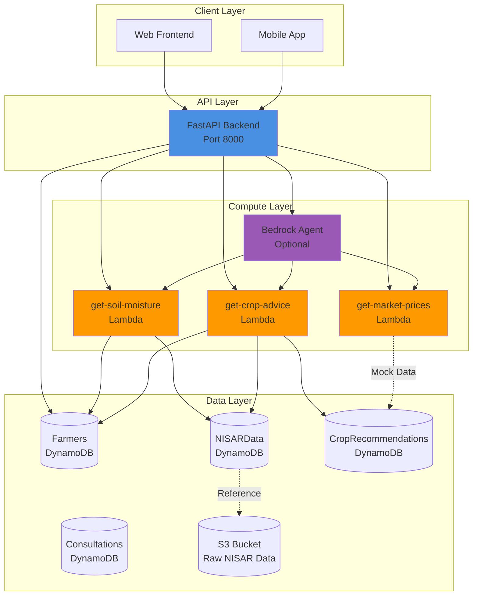
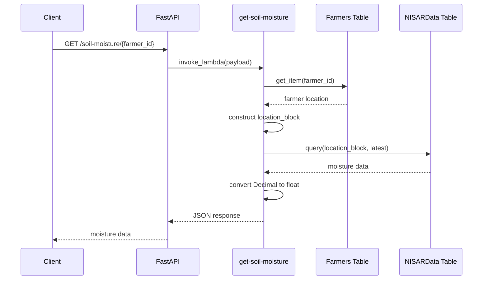
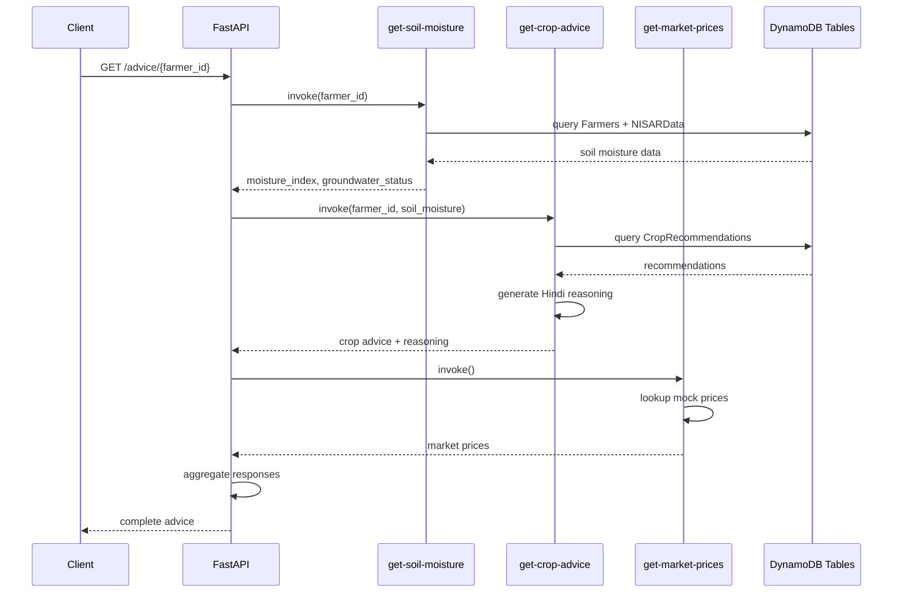
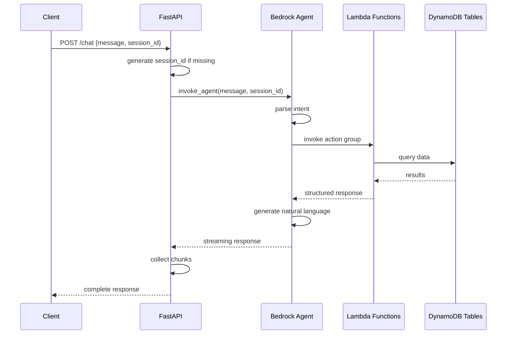
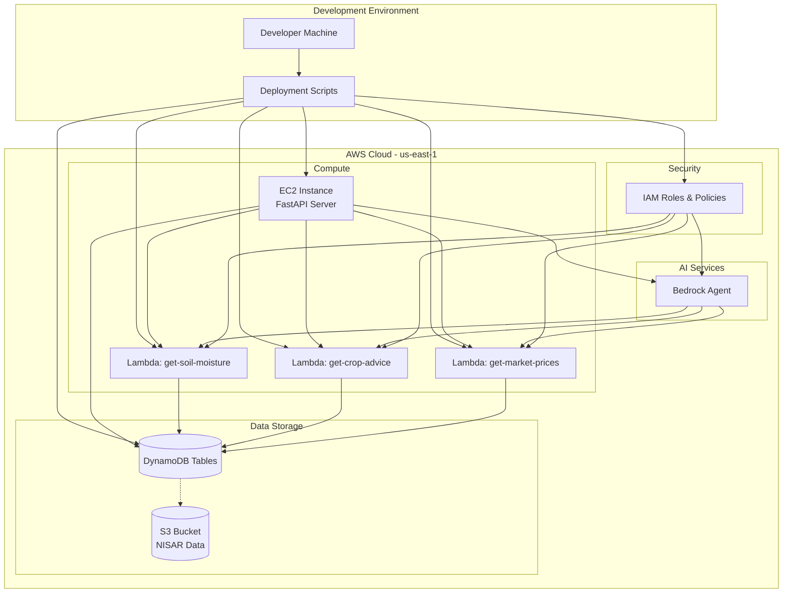

# Design Document: Piritiya Backend API and Infrastructure

## Overview

This is a RETROACTIVE design document that captures the existing implementation of the Piritiya Backend API and Infrastructure. The system provides agricultural advisory services to farmers in Uttar Pradesh by integrating NISAR satellite soil moisture data, groundwater status information, crop recommendations, and market prices.

The backend architecture follows a serverless microservices pattern using AWS services:
- **FastAPI REST API** as the main application server
- **AWS Lambda** for business logic execution
- **Amazon DynamoDB** for data persistence
- **AWS Bedrock Agent** for conversational AI (optional)

The system is designed to support both direct REST API access and conversational chatbot interactions, with a focus on water conservation and sustainable agriculture in water-stressed regions.

## Architecture

### System Architecture Diagram



### Architecture Patterns

**1. API Gateway Pattern**
- FastAPI serves as the central API gateway
- Routes requests to appropriate Lambda functions
- Handles CORS, error handling, and response formatting

**2. Serverless Microservices**
- Each Lambda function handles a specific domain (soil moisture, crop advice, market prices)
- Functions are independently deployable and scalable
- Pay-per-use pricing model

**3. Data Aggregation Pattern**
- `/advice/{farmer_id}` endpoint aggregates data from multiple Lambda functions
- Sequential invocation with data passing between calls
- Single unified response for comprehensive advice

**4. Dual Interface Pattern**
- REST API for direct programmatic access
- Bedrock Agent for conversational natural language interface
- Both interfaces use the same underlying Lambda functions

### Technology Stack

- **Runtime:** Python 3.11
- **Web Framework:** FastAPI 0.109.0
- **ASGI Server:** Uvicorn 0.27.0
- **AWS SDK:** boto3 1.34.0
- **Data Validation:** Pydantic 2.5.0
- **Configuration:** python-dotenv 1.0.0
- **Region:** us-east-1 (US East N. Virginia)

## Components and Interfaces

### 1. FastAPI Backend (backend/main.py)

**Purpose:** Central REST API server that orchestrates requests to Lambda functions and DynamoDB.

**Key Features:**
- CORS middleware allowing all origins
- Pydantic models for request validation
- boto3 clients for AWS service integration
- Error handling with appropriate HTTP status codes


**API Endpoints:**

| Endpoint | Method | Purpose | Lambda Invoked |
|----------|--------|---------|----------------|
| `/` | GET | API metadata and endpoint list | None |
| `/health` | GET | Health check | None |
| `/farmers` | GET | List all farmers | None (Direct DynamoDB) |
| `/farmers/{farmer_id}` | GET | Get farmer profile | None (Direct DynamoDB) |
| `/soil-moisture/{farmer_id}` | GET | Get soil moisture data | get-soil-moisture |
| `/crop-advice` | POST | Get crop recommendations | get-crop-advice |
| `/market-prices` | GET | Get market prices | get-market-prices |
| `/advice/{farmer_id}` | GET | Get complete aggregated advice | All 3 Lambdas |
| `/chat` | POST | Chatbot interface | Bedrock Agent |

**Request Models:**

```python
class SoilMoistureRequest(BaseModel):
    farmer_id: str

class CropAdviceRequest(BaseModel):
    farmer_id: str
    soil_moisture: Optional[float] = None

class MarketPriceRequest(BaseModel):
    crop: Optional[str] = None
    district: Optional[str] = None
```

**Lambda Invocation Helper:**

The backend uses a generic `invoke_lambda()` helper function that:
- Accepts function name and payload
- Invokes Lambda synchronously (RequestResponse)
- Parses JSON response from Lambda payload
- Raises HTTPException on errors


### 2. Lambda Function: get-soil-moisture

**Purpose:** Retrieves NISAR satellite soil moisture data for a specific farmer's location.

**Input Format:**

```json
{
  "farmer_id": "UP-LUCKNOW-MALIHABAD-00001"
}
```

Or Bedrock Agent format:
```json
{
  "requestBody": {
    "content": {
      "application/json": {
        "properties": [
          {"name": "farmer_id", "value": "UP-LUCKNOW-MALIHABAD-00001"}
        ]
      }
    }
  }
}
```

**Processing Logic:**

1. Extract `farmer_id` from event (handles both direct and Bedrock Agent formats)
2. Query Farmers table to get farmer location
3. Construct `location_block` key as `{district}-{block}`
4. Query NISARData table with location_block
5. Sort by measurement_date descending, limit 1 (most recent)
6. Convert Decimal types to float for JSON serialization
7. Return structured response

**Output Format:**

```json
{
  "statusCode": 200,
  "body": {
    "moisture_index": 35,
    "moisture_category": "Low",
    "trend": "Declining",
    "groundwater_status": "Critical",
    "groundwater_depth_meters": 45.2,
    "depletion_rate_cm_per_year": 8.5,
    "measurement_date": "2026-02-27T10:30:00Z",
    "location": "Malihabad, Lucknow",
    "village": "Kakori",
    "data_source": "NISAR Satellite (100m resolution)",
    "s3_raw_data_path": "s3://piritiya-nisar-data/..."
  }
}
```


**Error Handling:**
- 400: Missing farmer_id
- 404: Farmer not found or no NISAR data for location
- 500: Internal server error (DynamoDB access failure)

**Configuration:**
- Runtime: Python 3.11
- Memory: 512MB
- Timeout: 10 seconds
- IAM Role: PiritiyaLambdaExecutionRole

### 3. Lambda Function: get-crop-advice

**Purpose:** Generates crop recommendations based on soil moisture, groundwater status, and season.

**Input Format:**

```json
{
  "farmer_id": "UP-LUCKNOW-MALIHABAD-00001",
  "season": "Zaid (Summer)"
}
```

**Processing Logic:**

1. Extract farmer_id and optional season parameter
2. Query Farmers table to get location
3. Query NISARData table to get current moisture_index and groundwater_status
4. Query CropRecommendations table using farmer_id and season as composite key
5. Generate Hindi reasoning text using `generate_reasoning()` function
6. Generate sustainability alert if groundwater is Critical or Low
7. Convert Decimal types recursively for nested structures
8. Return recommendations with Hindi text (ensure_ascii=False)

**Reasoning Generation:**

The function generates context-aware Hindi explanations based on:
- Moisture index percentage
- Groundwater status (Critical, Low, Moderate, Good)
- Season
- Water conservation priorities

Example reasoning for Critical groundwater:
```
आपके क्षेत्र में भूजल स्तर गंभीर (Critical) है और मिट्टी की नमी केवल 35% है। 
पानी की अधिक खपत वाली फसलें जैसे गर्मी का धान लगाने से भूजल और कम हो जाएगा। 
हम कम पानी में उगने वाली फसलों की सलाह देते हैं जो 60-70% कम पानी में उगाई जा सकती हैं।
```


**Output Format:**

```json
{
  "statusCode": 200,
  "body": {
    "farmer_id": "UP-LUCKNOW-MALIHABAD-00001",
    "season": "Zaid (Summer)",
    "location": "Malihabad, Lucknow",
    "moisture_index": 35,
    "groundwater_status": "Critical",
    "recommended_crops": [
      {
        "crop_name": "Moong",
        "crop_name_hindi": "मूंग",
        "water_requirement_mm": 350,
        "duration_days": 60,
        "expected_yield_quintal_per_hectare": 8,
        "market_price_per_quintal": 7500,
        "sustainability_score": 95,
        "reason": "कम पानी में उगने वाली दलहन फसल"
      }
    ],
    "crops_to_avoid": [
      {
        "crop_name": "Summer Rice",
        "crop_name_hindi": "गर्मी का धान",
        "water_requirement_mm": 1200,
        "reason": "बहुत अधिक पानी की आवश्यकता",
        "estimated_groundwater_depletion_meters": 2.5
      }
    ],
    "reasoning": "आपके क्षेत्र में भूजल स्तर गंभीर...",
    "sustainability_alert": "⚠️ चेतावनी: आपके क्षेत्र में भूजल संकट है...",
    "last_updated": "2026-02-28T10:00:00Z"
  }
}
```

**Configuration:**
- Runtime: Python 3.11
- Memory: 512MB
- Timeout: 10 seconds
- Special: Uses ensure_ascii=False to preserve Hindi Unicode characters


### 4. Lambda Function: get-market-prices

**Purpose:** Returns current market prices for crops (simulating Agmarknet API).

**Input Format:**

```json
{
  "crop_names": ["Moong", "Urad", "Wheat"],
  "district": "Lucknow"
}
```

**Processing Logic:**

1. Extract crop_names array and optional district
2. Handle both string (comma-separated) and array formats
3. Map district to mandi (market) name
4. Look up each crop in PRICE_DATABASE (case-insensitive)
5. Return price, trend, and change percentage
6. Include Hindi crop names via `get_hindi_name()` helper
7. Return 0 price with note if crop not found

**Mock Price Database:**

The function maintains an in-memory price database with 10 crops:

| Crop | Price (INR/quintal) | Trend | Change % |
|------|---------------------|-------|----------|
| Moong | 7500 | Stable | 0 |
| Urad | 8200 | Rising | +5 |
| Arhar | 6800 | Stable | 0 |
| Summer Rice | 2100 | Falling | -3 |
| Wheat | 2100 | Stable | 0 |
| Mustard | 5500 | Rising | +8 |
| Bajra | 2500 | Stable | 0 |
| Sugarcane | 350 | Stable | 0 |
| Potato | 1200 | Falling | -10 |
| Tomato | 2500 | Rising | +15 |

**District-Mandi Mapping:**

```python
DISTRICT_MANDIS = {
    'Lucknow': 'Lucknow Mandi',
    'Kanpur': 'Kanpur Mandi',
    'Varanasi': 'Varanasi Mandi',
    'Agra': 'Agra Mandi',
    'Meerut': 'Meerut Mandi'
}
```


**Output Format:**

```json
{
  "statusCode": 200,
  "body": {
    "prices": [
      {
        "crop": "Moong",
        "crop_hindi": "मूंग",
        "price_per_quintal": 7500,
        "mandi": "Lucknow Mandi",
        "trend": "Stable",
        "change_percent": 0,
        "unit": "per quintal (100 kg)"
      }
    ],
    "district": "Lucknow",
    "mandi": "Lucknow Mandi",
    "source": "Agmarknet (Simulated)",
    "last_updated": "2026-02-28T06:00:00Z",
    "currency": "INR",
    "note": "Prices are indicative and may vary by quality and variety"
  }
}
```

**Configuration:**
- Runtime: Python 3.11
- Memory: 512MB
- Timeout: 10 seconds
- No external dependencies (pure Python)

### 5. Bedrock Agent Integration (Optional)

**Purpose:** Provides conversational AI interface for natural language queries.

**Configuration:**
- Agent ID: Set via BEDROCK_AGENT_ID environment variable
- Alias ID: Set via BEDROCK_AGENT_ALIAS_ID environment variable
- Region: us-east-1

**Action Groups:**

The Bedrock Agent is configured with three action groups, each mapped to a Lambda function:
1. Soil Moisture Action → get-soil-moisture Lambda
2. Crop Advice Action → get-crop-advice Lambda
3. Market Prices Action → get-market-prices Lambda

**Session Management:**

- Session IDs are generated using timestamp if not provided
- Format: `session-{unix_timestamp}`
- Sessions maintain conversation context across multiple turns


**Streaming Response Processing:**

```python
response = bedrock_agent.invoke_agent(
    agentId=agent_id,
    agentAliasId=alias_id,
    sessionId=session_id,
    inputText=message
)

result = ""
for event in response['completion']:
    if 'chunk' in event:
        chunk = event['chunk']
        if 'bytes' in chunk:
            result += chunk['bytes'].decode('utf-8')
```

**Note:** Bedrock Agent requires manual setup in AWS Console. The deployment scripts provide guidance but cannot fully automate agent creation.

## Data Models

### DynamoDB Table Schemas

#### 1. Farmers Table

**Purpose:** Store farmer profiles and location information.

**Schema:**

```
Primary Key: farmer_id (String, Partition Key)
Billing Mode: PAY_PER_REQUEST

Attributes:
{
  "farmer_id": "UP-LUCKNOW-MALIHABAD-00001",
  "farmer_name": "राजेश कुमार",
  "location": {
    "state": "Uttar Pradesh",
    "district": "Lucknow",
    "block": "Malihabad",
    "village": "Kakori",
    "coordinates": {
      "latitude": 26.8467,
      "longitude": 80.9462
    }
  },
  "land_details": {
    "total_area_hectares": 2.5,
    "soil_type": "Loamy",
    "irrigation_source": "Tubewell"
  },
  "phone_number": "+91-9876543210",
  "preferred_language": "Hindi",
  "registration_date": "2026-01-15T10:00:00Z"
}
```

**Access Patterns:**
- Get farmer by ID: `get_item(Key={'farmer_id': farmer_id})`
- List all farmers: `scan()`


#### 2. NISARData Table

**Purpose:** Store NISAR satellite soil moisture measurements.

**Schema:**

```
Primary Key: 
  - location_block (String, Partition Key) - Format: "{district}-{block}"
  - measurement_date (String, Sort Key) - ISO 8601 timestamp

Global Secondary Index:
  - FarmerIdIndex: farmer_id (Partition Key)

Billing Mode: PAY_PER_REQUEST

Attributes:
{
  "location_block": "Lucknow-Malihabad",
  "measurement_date": "2026-02-27T10:30:00Z",
  "farmer_id": "UP-LUCKNOW-MALIHABAD-00001",
  "moisture_index": 35,
  "moisture_category": "Low",
  "trend": "Declining",
  "groundwater_status": {
    "status": "Critical",
    "depth_meters": 45.2,
    "depletion_rate_cm_per_year": 8.5
  },
  "s3_raw_data_path": "s3://piritiya-nisar-data/2026/02/27/lucknow_malihabad.tif",
  "ttl": 1709107200
}
```

**Access Patterns:**
- Get latest measurement for location: `query(KeyConditionExpression='location_block = :location', ScanIndexForward=False, Limit=1)`
- Get measurements by farmer: `query(IndexName='FarmerIdIndex', KeyConditionExpression='farmer_id = :farmer_id')`

**TTL Configuration:**
- TTL attribute: `ttl`
- Expiration: 30 days after measurement_date
- Automatic cleanup of old data


#### 3. CropRecommendations Table

**Purpose:** Cache crop recommendations by farmer and season.

**Schema:**

```
Primary Key:
  - farmer_id (String, Partition Key)
  - season (String, Sort Key) - Values: "Zaid (Summer)", "Rabi (Winter)", "Kharif (Monsoon)"

Billing Mode: PAY_PER_REQUEST

Attributes:
{
  "farmer_id": "UP-LUCKNOW-MALIHABAD-00001",
  "season": "Zaid (Summer)",
  "recommended_crops": [
    {
      "crop_name": "Moong",
      "crop_name_hindi": "मूंग",
      "water_requirement_mm": 350,
      "duration_days": 60,
      "expected_yield_quintal_per_hectare": 8,
      "market_price_per_quintal": 7500,
      "sustainability_score": 95,
      "reason": "कम पानी में उगने वाली दलहन फसल"
    }
  ],
  "crops_to_avoid": [
    {
      "crop_name": "Summer Rice",
      "crop_name_hindi": "गर्मी का धान",
      "water_requirement_mm": 1200,
      "reason": "बहुत अधिक पानी की आवश्यकता",
      "estimated_groundwater_depletion_meters": 2.5
    }
  ],
  "last_updated": "2026-02-28T10:00:00Z"
}
```

**Access Patterns:**
- Get recommendations for farmer and season: `get_item(Key={'farmer_id': farmer_id, 'season': season})`
- List all seasons for farmer: `query(KeyConditionExpression='farmer_id = :farmer_id')`

**Design Rationale:**
- Composite key allows multiple seasonal recommendations per farmer
- Pre-computed recommendations reduce Lambda execution time
- Sustainability scores guide water-efficient crop selection


#### 4. Consultations Table

**Purpose:** Store chatbot conversation history and consultation records.

**Schema:**

```
Primary Key:
  - farmer_id (String, Partition Key)
  - timestamp (String, Sort Key) - ISO 8601 timestamp

Global Secondary Index:
  - ConsultationIdIndex: consultation_id (Partition Key)

Billing Mode: PAY_PER_REQUEST

Attributes:
{
  "farmer_id": "UP-LUCKNOW-MALIHABAD-00001",
  "timestamp": "2026-02-28T14:30:00Z",
  "consultation_id": "CONS-20260228-001",
  "query_text": "मेरी मिट्टी में नमी कितनी है?",
  "response_text": "आपके खेत में मिट्टी की नमी 35% है...",
  "data_sources_used": ["NISARData", "CropRecommendations"],
  "recommendation_type": "soil_moisture",
  "session_id": "session-1709126400",
  "response_time_ms": 1250
}
```

**Access Patterns:**
- Get consultations by farmer: `query(KeyConditionExpression='farmer_id = :farmer_id')`
- Get consultation by ID: `query(IndexName='ConsultationIdIndex', KeyConditionExpression='consultation_id = :id')`
- Get recent consultations: `query(KeyConditionExpression='farmer_id = :farmer_id', ScanIndexForward=False, Limit=10)`

**Use Cases:**
- Conversation history for chatbot context
- Analytics on farmer queries
- Audit trail for recommendations
- Performance monitoring (response_time_ms)

## Data Flow Diagrams

### Flow 1: Get Soil Moisture Data




### Flow 2: Get Complete Advice (Aggregated)



### Flow 3: Chatbot Conversation




## Correctness Properties

A property is a characteristic or behavior that should hold true across all valid executions of a system—essentially, a formal statement about what the system should do. Properties serve as the bridge between human-readable specifications and machine-verifiable correctness guarantees.

### Property Reflection

After analyzing all acceptance criteria, I identified the following redundancies:

- Properties 2.2 and 2.3 can be combined into a single property about farmer lookup behavior
- Properties 3.3, 3.6 can be combined into a property about soil moisture response structure
- Properties 4.5, 4.6 can be combined into a property about crop recommendation structure
- Properties 5.4, 5.5 can be combined into a property about market price response structure
- Properties 6.2, 6.3, 6.4, 6.5 are all subsumed by a single property about aggregated response structure
- Properties 18.1, 18.2, 18.3 can be combined into a general error handling property
- Properties 19.1, 19.2, 19.3 can be combined into a property about Hindi language support
- Properties 20.1, 20.4 can be combined into a property about recommendation field completeness

### Property 1: CORS Headers Present

For any HTTP request to any endpoint, the response should include CORS headers allowing cross-origin access.

**Validates: Requirements 1.3**

### Property 2: Farmer Lookup Returns Valid Data or 404

For any farmer_id, querying GET /farmers/{farmer_id} should either return a farmer profile with all required fields (farmer_id, farmer_name, location, land_details) or return HTTP 404 if the farmer doesn't exist.

**Validates: Requirements 2.2, 2.3**

### Property 3: Soil Moisture Response Structure

For any valid farmer_id with NISAR data, GET /soil-moisture/{farmer_id} should return a response containing moisture_index, moisture_category, trend, groundwater_status, measurement_date, location, and s3_raw_data_path fields.

**Validates: Requirements 3.3, 3.6**


### Property 4: Missing NISAR Data Returns 404

For any farmer_id where no NISAR data exists for their location, GET /soil-moisture/{farmer_id} should return HTTP 404 status code.

**Validates: Requirements 3.5**

### Property 5: Crop Advice Contains Hindi Text

For any valid crop advice request, the response should contain reasoning text with Hindi Unicode characters (Devanagari script), and if sustainability_alert is present, it should also contain Hindi text.

**Validates: Requirements 4.3, 19.1, 19.2**

### Property 6: Crop Recommendation Structure Completeness

For any valid crop advice response, each item in recommended_crops should contain crop_name, crop_name_hindi, water_requirement_mm, duration_days, expected_yield_quintal_per_hectare, sustainability_score, and reason fields. Each item in crops_to_avoid should contain crop_name, crop_name_hindi, water_requirement_mm, reason, and estimated_groundwater_depletion_meters fields.

**Validates: Requirements 4.5, 4.6, 20.1, 20.4**

### Property 7: Seasonal Recommendations

For any valid farmer_id and any season value (Zaid, Rabi, Kharif), POST /crop-advice should return recommendations appropriate to that season.

**Validates: Requirements 4.7**

### Property 8: Market Price Response Structure

For any crop in the market prices response, the item should contain crop, crop_hindi, price_per_quintal, mandi, trend, change_percent, and unit fields.

**Validates: Requirements 5.4, 5.5, 19.3**

### Property 9: Aggregated Advice Contains All Sections

For any valid farmer_id, GET /advice/{farmer_id} should return a response containing soil_moisture, crop_advice, and market_prices sections, each with their respective data structures.

**Validates: Requirements 6.2, 6.3, 6.4, 6.5**


### Property 10: Aggregation Failure Returns 500

For any farmer_id, if any of the three Lambda function invocations in GET /advice/{farmer_id} fails, the endpoint should return HTTP 500 status code.

**Validates: Requirements 6.6**

### Property 11: Chat Session ID Generation

For any POST /chat request without a session_id parameter, the response should include a generated session_id in the format "session-{timestamp}".

**Validates: Requirements 7.3**

### Property 12: Chat Response Structure

For any valid chat request (when Bedrock is configured), the response should contain response, session_id, and message fields.

**Validates: Requirements 7.6**

### Property 13: HTTP Error Status Codes

For any endpoint, missing required parameters should return HTTP 400, missing resources should return HTTP 404, and AWS service failures should return HTTP 500, each with appropriate error messages.

**Validates: Requirements 18.1, 18.2, 18.3, 18.4, 18.5**

### Property 14: Water Conservation in Critical Areas

For any farmer in a location with groundwater_status "Critical", the recommended_crops list should only contain crops with water_requirement_mm below 500mm, and crops_to_avoid should contain crops with water_requirement_mm above 1000mm.

**Validates: Requirements 20.2, 20.3**

### Property 15: Water Conservation Reasoning

For any crop advice response where groundwater_status is "Critical" or "Low", the reasoning text should mention water conservation concepts (in Hindi).

**Validates: Requirements 20.5**

## Error Handling

### Error Handling Strategy

The system implements a layered error handling approach:


**1. FastAPI Layer Error Handling**

```python
# HTTP 400 - Bad Request
if not required_parameter:
    raise HTTPException(status_code=400, detail="Missing required parameter")

# HTTP 404 - Not Found
if 'Item' not in response:
    raise HTTPException(status_code=404, detail="Farmer not found")

# HTTP 500 - Internal Server Error
except Exception as e:
    raise HTTPException(status_code=500, detail=str(e))
```

**2. Lambda Function Error Handling**

Each Lambda function implements consistent error handling:

```python
try:
    # Business logic
    pass
except KeyError as e:
    return {
        'statusCode': 400,
        'body': json.dumps({'error': f'Missing required field: {str(e)}'})
    }
except Exception as e:
    print(f"Error: {str(e)}")  # CloudWatch logging
    return {
        'statusCode': 500,
        'body': json.dumps({'error': f'Internal server error: {str(e)}'})
    }
```

**3. DynamoDB Error Handling**

- **ResourceNotFoundException**: Return 404 when table doesn't exist
- **ProvisionedThroughputExceededException**: Handled by PAY_PER_REQUEST billing mode
- **ValidationException**: Return 400 for invalid query parameters

**4. Bedrock Agent Error Handling**

```python
if not agent_id or not alias_id:
    raise HTTPException(
        status_code=500,
        detail="Bedrock agent not configured. Set BEDROCK_AGENT_ID and BEDROCK_AGENT_ALIAS_ID in .env"
    )
```

### Error Response Format

All errors follow a consistent JSON structure:

```json
{
  "error": "Descriptive error message",
  "detail": "Additional context (optional)"
}
```


### Logging Strategy

**CloudWatch Logs:**
- Lambda functions log errors using `print()` statements
- Logs are automatically sent to CloudWatch Logs
- Log groups: `/aws/lambda/get-soil-moisture`, `/aws/lambda/get-crop-advice`, `/aws/lambda/get-market-prices`

**Log Levels:**
- Errors: Exceptions and failures
- Info: Function invocations (implicit via Lambda metrics)

**Note:** The current implementation uses basic print-based logging. Production systems should use structured logging with the `logging` module.

## Testing Strategy

### Dual Testing Approach

The system requires both unit testing and property-based testing for comprehensive coverage:

**Unit Tests:**
- Specific examples demonstrating correct behavior
- Edge cases (empty data, missing fields, boundary conditions)
- Error conditions (404, 500 responses)
- Integration points between components
- Bedrock Agent event format parsing

**Property-Based Tests:**
- Universal properties that hold for all inputs
- Comprehensive input coverage through randomization
- Minimum 100 iterations per property test
- Each test references its design document property

### Property-Based Testing Configuration

**Library Selection:**
- Python: Use `hypothesis` library for property-based testing
- Installation: `pip install hypothesis`

**Test Configuration:**

```python
from hypothesis import given, settings
import hypothesis.strategies as st

@settings(max_examples=100)
@given(farmer_id=st.text(min_size=1))
def test_property_2_farmer_lookup(farmer_id):
    """
    Feature: piritiya-backend-api
    Property 2: Farmer Lookup Returns Valid Data or 404
    """
    response = requests.get(f"{API_BASE}/farmers/{farmer_id}")
    assert response.status_code in [200, 404]
    
    if response.status_code == 200:
        data = response.json()
        assert 'farmer_id' in data
        assert 'farmer_name' in data
        assert 'location' in data
        assert 'land_details' in data
```


### Test Coverage Requirements

**Unit Tests Should Cover:**

1. **Endpoint Examples:**
   - Root endpoint returns metadata (Property 1.1)
   - Health check returns status (Property 1.2)
   - Farmers list endpoint (Property 2.1)
   - Soil moisture endpoint (Property 3.1)
   - Crop advice endpoint (Property 4.1)
   - Market prices endpoint (Property 5.1)
   - Aggregated advice endpoint (Property 6.1)
   - Chat endpoint (Property 7.1)

2. **Edge Cases:**
   - Empty farmer list
   - No NISAR data for location
   - Missing optional parameters
   - Invalid season values
   - Unknown crop names

3. **Error Conditions:**
   - Missing required parameters (400)
   - Non-existent resources (404)
   - DynamoDB access failures (500)
   - Bedrock configuration missing (500)

4. **Specific Scenarios:**
   - Critical groundwater with low moisture triggers sustainability alert (Property 4.4)
   - Market prices for at least 10 crops (Property 5.3)
   - Bedrock configuration error message (Property 7.5)
   - Currency and unit in market prices (Property 5.6)

**Property Tests Should Cover:**

1. CORS headers on all responses (Property 1)
2. Farmer lookup behavior (Property 2)
3. Soil moisture response structure (Property 3)
4. Missing NISAR data handling (Property 4)
5. Hindi text in crop advice (Property 5)
6. Crop recommendation completeness (Property 6)
7. Seasonal recommendations (Property 7)
8. Market price structure (Property 8)
9. Aggregated advice structure (Property 9)
10. Aggregation failure handling (Property 10)
11. Session ID generation (Property 11)
12. Chat response structure (Property 12)
13. HTTP error codes (Property 13)
14. Water conservation in critical areas (Property 14)
15. Water conservation reasoning (Property 15)

### Test Data Strategy

**Mock Data Requirements:**
- 3 farmer profiles from different districts
- NISAR data with varying moisture levels and groundwater status
- Crop recommendations for all three seasons
- Market prices for 10+ crops
- Sample consultation records

**Test Data Location:**
- Mock data script: `scripts/load_mock_data.py`
- Test fixtures: `backend/tests/fixtures/`

### Integration Testing

**API Integration Tests:**
- Test complete flows (e.g., /advice endpoint calling all 3 Lambdas)
- Test DynamoDB integration
- Test Lambda invocation from FastAPI
- Test Bedrock Agent integration (if configured)

**Deployment Verification:**
- Verify all DynamoDB tables exist
- Verify all Lambda functions are deployed
- Verify IAM roles and permissions
- Verify environment variables are set


## AWS Service Integration Patterns

### 1. DynamoDB Integration Pattern

**Access Pattern:**

```python
# Initialize resource
dynamodb = boto3.resource('dynamodb', region_name=os.getenv('AWS_REGION', 'us-east-1'))

# Get table reference
table = dynamodb.Table('Farmers')

# Single item retrieval
response = table.get_item(Key={'farmer_id': farmer_id})
item = response.get('Item')

# Query with sort key
response = table.query(
    KeyConditionExpression='location_block = :location',
    ExpressionAttributeValues={':location': location_block},
    ScanIndexForward=False,  # Descending order
    Limit=1
)

# Scan (list all)
response = table.scan()
items = response.get('Items', [])
```

**Data Type Handling:**

DynamoDB returns numeric values as `Decimal` type, which must be converted for JSON serialization:

```python
from decimal import Decimal

def decimal_to_float(obj):
    if isinstance(obj, Decimal):
        return float(obj)
    if isinstance(obj, dict):
        return {k: decimal_to_float(v) for k, v in obj.items()}
    if isinstance(obj, list):
        return [decimal_to_float(item) for item in obj]
    return obj
```

**Billing Mode:**

All tables use `PAY_PER_REQUEST` billing mode:
- No capacity planning required
- Automatic scaling
- Pay only for actual read/write requests
- Suitable for unpredictable workloads

### 2. Lambda Invocation Pattern

**Synchronous Invocation:**

```python
lambda_client = boto3.client('lambda', region_name=os.getenv('AWS_REGION', 'us-east-1'))

response = lambda_client.invoke(
    FunctionName='get-soil-moisture',
    InvocationType='RequestResponse',  # Synchronous
    Payload=json.dumps({'farmer_id': farmer_id})
)

result = json.loads(response['Payload'].read())
```

**Invocation Types:**
- `RequestResponse`: Synchronous (used in this system)
- `Event`: Asynchronous (not used)
- `DryRun`: Validation only (not used)

**Error Handling:**

Lambda errors are returned in the response payload:

```python
if result.get('statusCode') != 200:
    error_body = json.loads(result['body'])
    raise HTTPException(status_code=result['statusCode'], detail=error_body.get('error'))
```


### 3. Bedrock Agent Integration Pattern

**Agent Invocation:**

```python
bedrock_agent = boto3.client('bedrock-agent-runtime', region_name=os.getenv('AWS_REGION', 'us-east-1'))

response = bedrock_agent.invoke_agent(
    agentId=os.getenv('BEDROCK_AGENT_ID'),
    agentAliasId=os.getenv('BEDROCK_AGENT_ALIAS_ID'),
    sessionId=session_id,
    inputText=message
)
```

**Streaming Response Processing:**

Bedrock Agent returns streaming responses that must be collected:

```python
result = ""
for event in response['completion']:
    if 'chunk' in event:
        chunk = event['chunk']
        if 'bytes' in chunk:
            result += chunk['bytes'].decode('utf-8')
```

**Action Group Event Format:**

When Bedrock Agent invokes Lambda functions, it uses a specific event format:

```json
{
  "requestBody": {
    "content": {
      "application/json": {
        "properties": [
          {"name": "farmer_id", "value": "UP-LUCKNOW-MALIHABAD-00001"},
          {"name": "season", "value": "Zaid"}
        ]
      }
    }
  }
}
```

Lambda functions must handle both this format and direct invocation format.

### 4. IAM Permissions Pattern

**Lambda Execution Role:**

The `PiritiyaLambdaExecutionRole` requires these managed policies:

1. **AWSLambdaBasicExecutionRole**
   - CloudWatch Logs write permissions
   - Required for all Lambda functions

2. **AmazonDynamoDBFullAccess**
   - Read/write access to all DynamoDB tables
   - Required for data retrieval and storage

3. **AmazonS3ReadOnlyAccess**
   - Read access to S3 buckets
   - Required for NISAR raw data references

**Trust Policy:**

```json
{
  "Version": "2012-10-17",
  "Statement": [
    {
      "Effect": "Allow",
      "Principal": {
        "Service": "lambda.amazonaws.com"
      },
      "Action": "sts:AssumeRole"
    }
  ]
}
```


**Bedrock Agent Permissions:**

Bedrock Agent requires additional permissions to invoke Lambda functions:

```json
{
  "Version": "2012-10-17",
  "Statement": [
    {
      "Effect": "Allow",
      "Principal": {
        "Service": "bedrock.amazonaws.com"
      },
      "Action": "lambda:InvokeFunction",
      "Resource": [
        "arn:aws:lambda:us-east-1:*:function:get-soil-moisture",
        "arn:aws:lambda:us-east-1:*:function:get-crop-advice",
        "arn:aws:lambda:us-east-1:*:function:get-market-prices"
      ]
    }
  ]
}
```

### 5. Environment Configuration Pattern

**Environment Variables:**

```bash
# AWS Configuration
AWS_REGION=us-east-1

# Bedrock Agent (Optional)
BEDROCK_AGENT_ID=XXXXXXXXXX
BEDROCK_AGENT_ALIAS_ID=XXXXXXXXXX

# AWS Credentials (for local development)
AWS_ACCESS_KEY_ID=your_access_key
AWS_SECRET_ACCESS_KEY=your_secret_key
```

**Configuration Loading:**

```python
import os
from dotenv import load_dotenv

load_dotenv()

AWS_REGION = os.getenv('AWS_REGION', 'us-east-1')
BEDROCK_AGENT_ID = os.getenv('BEDROCK_AGENT_ID')
BEDROCK_AGENT_ALIAS_ID = os.getenv('BEDROCK_AGENT_ALIAS_ID')
```

**Deployment Configuration:**

Lambda functions receive environment variables during deployment:

```bash
aws lambda update-function-configuration \
    --function-name get-soil-moisture \
    --environment Variables={AWS_REGION=us-east-1}
```

## Deployment Architecture

### Infrastructure Components




### Deployment Process

**1. DynamoDB Tables Creation**

```bash
python scripts/create_dynamodb_tables.py
```

Creates:
- Farmers table (partition key: farmer_id)
- NISARData table (composite key: location_block + measurement_date, GSI: farmer_id)
- CropRecommendations table (composite key: farmer_id + season)
- Consultations table (composite key: farmer_id + timestamp, GSI: consultation_id)

**2. Mock Data Loading**

```bash
python scripts/load_mock_data.py
```

Loads:
- 3 farmer profiles (Lucknow, Kanpur, Varanasi)
- NISAR data for each location
- Crop recommendations for Zaid season
- Sample consultation records

**3. Lambda Functions Deployment**

```bash
cd lambda_functions
./deploy.sh
```

Process:
1. Creates IAM role `PiritiyaLambdaExecutionRole` if not exists
2. Attaches required policies (Lambda, DynamoDB, S3)
3. Packages each Lambda function with dependencies
4. Creates or updates Lambda functions in AWS
5. Configures runtime (Python 3.11), memory (512MB), timeout (10s)

**4. FastAPI Server Deployment**

```bash
cd backend
pip install -r requirements.txt
uvicorn main:app --host 0.0.0.0 --port 8000
```

For production:
```bash
uvicorn main:app --host 0.0.0.0 --port 8000 --workers 4
```

**5. Bedrock Agent Setup (Manual)**

Currently requires manual setup in AWS Console:
1. Create Bedrock Agent
2. Configure action groups for each Lambda function
3. Define input/output schemas
4. Create agent alias
5. Note agent ID and alias ID for .env configuration

### Deployment Scripts

**create_dynamodb_tables.py:**
- Creates all 4 DynamoDB tables
- Handles ResourceInUseException gracefully
- Tags tables with Project=Piritiya, Environment=Development
- Outputs table ARNs

**load_mock_data.py:**
- Loads farmer profiles with Hindi names
- Loads NISAR data with varying groundwater conditions
- Loads crop recommendations with sustainability scores
- Loads sample consultation records

**deploy.sh:**
- Creates IAM role with trust policy
- Attaches managed policies
- Packages Lambda functions with dependencies
- Creates/updates Lambda functions
- Supports AWS_REGION environment variable


### Deployment Verification

**1. Verify DynamoDB Tables:**

```bash
aws dynamodb list-tables --region us-east-1
```

Expected output:
```json
{
  "TableNames": [
    "Farmers",
    "NISARData",
    "CropRecommendations",
    "Consultations"
  ]
}
```

**2. Verify Lambda Functions:**

```bash
aws lambda list-functions --region us-east-1 --query 'Functions[?starts_with(FunctionName, `get-`)].FunctionName'
```

Expected output:
```json
[
  "get-soil-moisture",
  "get-crop-advice",
  "get-market-prices"
]
```

**3. Verify FastAPI Server:**

```bash
curl http://localhost:8000/health
```

Expected output:
```json
{
  "status": "healthy",
  "service": "piritiya-api"
}
```

**4. Test End-to-End Flow:**

```bash
# Get farmer data
curl http://localhost:8000/farmers/UP-LUCKNOW-MALIHABAD-00001

# Get soil moisture
curl http://localhost:8000/soil-moisture/UP-LUCKNOW-MALIHABAD-00001

# Get complete advice
curl http://localhost:8000/advice/UP-LUCKNOW-MALIHABAD-00001
```

## Design Decisions and Rationales

### 1. Serverless Architecture

**Decision:** Use AWS Lambda for business logic instead of monolithic backend.

**Rationale:**
- Independent scaling of each function
- Pay-per-use pricing (cost-effective for variable load)
- No server management overhead
- Easy to add new functions without affecting existing ones

**Trade-offs:**
- Cold start latency (mitigated by 512MB memory allocation)
- Vendor lock-in to AWS
- More complex deployment compared to monolith

### 2. DynamoDB as Primary Database

**Decision:** Use DynamoDB instead of relational database (RDS).

**Rationale:**
- Serverless and fully managed
- PAY_PER_REQUEST billing matches usage patterns
- Fast single-item lookups by key
- Global Secondary Indexes for alternate access patterns
- Built-in TTL for automatic data expiration

**Trade-offs:**
- Limited query flexibility (no joins)
- Decimal type conversion required for JSON
- No ACID transactions across tables (not needed for this use case)


### 3. FastAPI as API Gateway

**Decision:** Use FastAPI instead of AWS API Gateway.

**Rationale:**
- Simpler development and testing (local server)
- Automatic OpenAPI documentation
- Pydantic validation for request/response
- Python ecosystem integration
- Lower cost for development phase

**Trade-offs:**
- Requires server hosting (EC2 or container)
- Manual CORS configuration
- No built-in rate limiting or API keys
- Less scalable than managed API Gateway

**Future Consideration:** Migrate to AWS API Gateway for production deployment.

### 4. Mock Data for Development

**Decision:** Use mock NISAR and Agmarknet data instead of real APIs.

**Rationale:**
- NISAR satellite not yet operational (launch 2024)
- Agmarknet API access requires government approval
- Enables development and testing without external dependencies
- Predictable data for consistent testing

**Future Migration Path:**
- Replace get-soil-moisture Lambda with NISAR data pipeline
- Replace get-market-prices Lambda with Agmarknet API integration
- Keep same API contract for backward compatibility

### 5. Hindi Language Support

**Decision:** Generate Hindi text in Lambda functions, not in frontend.

**Rationale:**
- Centralized language logic
- Consistent translations across all clients
- Reduces frontend complexity
- Enables future multi-language support

**Implementation:**
- Use `ensure_ascii=False` in JSON serialization
- Store Hindi text in DynamoDB (UTF-8 encoding)
- Generate context-aware Hindi reasoning based on data

### 6. Composite Keys for Seasonal Data

**Decision:** Use farmer_id + season as composite key in CropRecommendations table.

**Rationale:**
- Supports multiple seasons per farmer
- Efficient queries for specific season
- Natural data partitioning
- Enables seasonal recommendation caching

**Alternative Considered:** Single key with season as attribute (rejected due to inefficient queries).

### 7. Synchronous Lambda Invocation

**Decision:** Use RequestResponse invocation type instead of Event (async).

**Rationale:**
- API requires immediate response
- Error handling needs to propagate to client
- Simpler debugging and testing
- Acceptable latency (<1 second per Lambda)

**Trade-offs:**
- Higher latency than async (but required for API)
- Client waits for all Lambda executions
- No automatic retry on failure


### 8. Bedrock Agent for Chatbot

**Decision:** Use AWS Bedrock Agent instead of custom LLM integration.

**Rationale:**
- Managed service with built-in conversation management
- Action groups map naturally to Lambda functions
- Session management handled automatically
- No need to manage LLM infrastructure

**Trade-offs:**
- Manual setup required (not fully automated)
- Limited to AWS regions with Bedrock availability
- Higher cost than self-hosted LLM
- Vendor lock-in

**Alternative Considered:** OpenAI API (rejected due to data privacy concerns for farmer information).

### 9. Location-Based Data Partitioning

**Decision:** Use location_block (district-block) as partition key for NISAR data.

**Rationale:**
- Natural geographic partitioning
- Multiple farmers per location share data
- Efficient queries for location-based data
- Reduces data duplication

**Schema:**
```
location_block = "{district}-{block}"  # e.g., "Lucknow-Malihabad"
```

**Alternative Considered:** farmer_id as partition key (rejected due to data duplication across farmers in same location).

### 10. PAY_PER_REQUEST Billing Mode

**Decision:** Use on-demand billing instead of provisioned capacity.

**Rationale:**
- Unpredictable usage patterns during development
- No capacity planning required
- Automatic scaling
- Cost-effective for low to moderate traffic

**Future Consideration:** Switch to provisioned capacity with auto-scaling for production if usage patterns become predictable.

## Known Limitations and Future Improvements

### Current Limitations

1. **No Authentication/Authorization**
   - API is open to all requests
   - No user identity verification
   - No role-based access control

2. **No Rate Limiting**
   - Vulnerable to abuse
   - No request throttling
   - No API quotas

3. **Mock Data Only**
   - No real NISAR satellite data
   - No real Agmarknet market prices
   - Limited to 3 sample farmers

4. **Manual Bedrock Setup**
   - Agent creation not automated
   - Requires AWS Console access
   - Configuration prone to errors

5. **Basic Error Handling**
   - Generic error messages
   - No structured error codes
   - Limited error context

6. **No Monitoring/Alerting**
   - No custom CloudWatch metrics
   - No error rate alarms
   - No performance dashboards

7. **Development-Only Deployment**
   - No production infrastructure
   - No CI/CD pipeline
   - No automated testing

8. **CORS Allows All Origins**
   - Security risk for production
   - Should be restricted to known domains


### Future Improvements

**Phase 1: Security and Reliability**
- Implement JWT-based authentication
- Add role-based access control (farmer, advisor, admin)
- Configure rate limiting per user
- Restrict CORS to known origins
- Add request validation middleware
- Implement structured error codes

**Phase 2: Production Readiness**
- Migrate to AWS API Gateway
- Configure CloudWatch alarms for errors
- Add custom metrics (response time, success rate)
- Implement backup and disaster recovery
- Create production deployment configuration
- Set up CI/CD pipeline with GitHub Actions

**Phase 3: Real Data Integration**
- Integrate NISAR satellite data pipeline
- Connect to Agmarknet API
- Implement data validation and quality checks
- Add data freshness monitoring
- Create data update schedules

**Phase 4: Advanced Features**
- Multi-language support (Hindi, English, regional languages)
- Historical data analysis and trends
- Predictive crop yield modeling
- Weather integration
- Irrigation scheduling recommendations
- Farmer community features

**Phase 5: Scale and Performance**
- Implement caching layer (Redis/ElastiCache)
- Add CDN for static content
- Optimize Lambda cold starts
- Implement connection pooling for DynamoDB
- Add read replicas for high-traffic regions
- Implement data archival strategy

## Appendix

### A. API Endpoint Reference

Complete API documentation is available at `http://localhost:8000/docs` (FastAPI automatic documentation).

### B. DynamoDB Table Schemas

Detailed schemas are documented in the Data Models section above.

### C. Lambda Function Specifications

| Function | Runtime | Memory | Timeout | Dependencies |
|----------|---------|--------|---------|--------------|
| get-soil-moisture | Python 3.11 | 512MB | 10s | boto3 |
| get-crop-advice | Python 3.11 | 512MB | 10s | boto3 |
| get-market-prices | Python 3.11 | 512MB | 10s | None |

### D. Environment Variables

| Variable | Required | Default | Description |
|----------|----------|---------|-------------|
| AWS_REGION | No | us-east-1 | AWS region for services |
| BEDROCK_AGENT_ID | No | None | Bedrock Agent ID for chatbot |
| BEDROCK_AGENT_ALIAS_ID | No | None | Bedrock Agent Alias ID |
| AWS_ACCESS_KEY_ID | Yes* | None | AWS credentials (local dev) |
| AWS_SECRET_ACCESS_KEY | Yes* | None | AWS credentials (local dev) |

*Required for local development. Not needed when running on EC2 with IAM role.

### E. Deployment Checklist

- [ ] Create DynamoDB tables
- [ ] Load mock data
- [ ] Deploy Lambda functions
- [ ] Verify Lambda IAM permissions
- [ ] Configure environment variables
- [ ] Start FastAPI server
- [ ] Test health endpoint
- [ ] Test farmer endpoints
- [ ] Test Lambda invocations
- [ ] (Optional) Configure Bedrock Agent
- [ ] (Optional) Test chatbot endpoint

### F. Troubleshooting Guide

**Issue: Lambda invocation fails with AccessDenied**
- Solution: Verify IAM role has Lambda invoke permissions
- Check: `aws iam get-role --role-name PiritiyaLambdaExecutionRole`

**Issue: DynamoDB query returns empty results**
- Solution: Verify mock data is loaded
- Check: `aws dynamodb scan --table-name Farmers --region us-east-1`

**Issue: Decimal serialization error**
- Solution: Use `decimal_to_float()` helper function
- Ensure all Decimal values are converted before JSON serialization

**Issue: Hindi text displays as Unicode escapes**
- Solution: Use `ensure_ascii=False` in `json.dumps()`
- Verify client accepts UTF-8 encoding

**Issue: Bedrock Agent not found**
- Solution: Verify BEDROCK_AGENT_ID and BEDROCK_AGENT_ALIAS_ID are set
- Check agent exists in AWS Console

**Issue: CORS errors in browser**
- Solution: Verify CORS middleware is configured
- Check browser console for specific CORS error

---

**Document Version:** 1.0  
**Last Updated:** 2026-02-28  
**Status:** Retroactive Documentation of Existing Implementation
