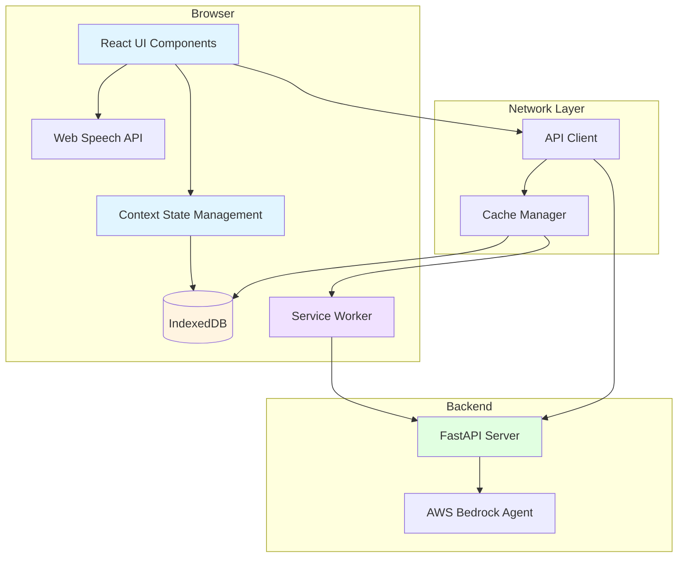
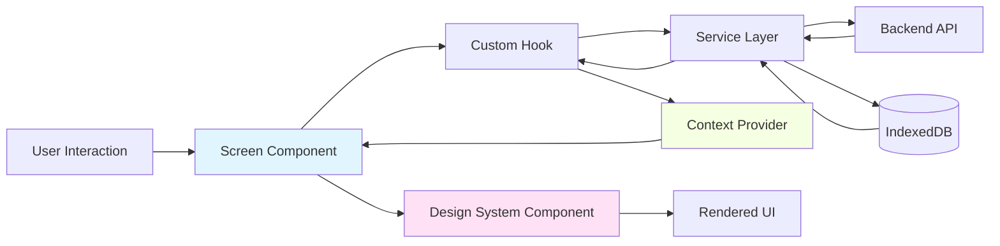

# Design Document: Piritiya Chatbot Frontend

## Overview

The Piritiya Chatbot Frontend is a Progressive Web App (PWA) that provides farmers in Uttar Pradesh with voice-first, offline-capable access to agricultural advice. The application is built with React 18+ and implements a mobile-first, accessible interface optimized for low-bandwidth networks and budget smartphones.

### Key Design Goals

1. **Offline-First Architecture**: Service workers and IndexedDB enable full functionality without network connectivity
2. **Voice-First Interaction**: Web Speech API integration for speech-to-text and text-to-speech in Hindi and English
3. **Performance on 2G Networks**: Aggressive caching, code splitting, and optimized assets for slow connections
4. **Accessibility**: WCAG 2.1 AA compliance with large touch targets and high contrast for outdoor use
5. **Progressive Enhancement**: Core functionality works on all devices, enhanced features on capable browsers

### Technology Stack

- **Framework**: React 18+ (or Next.js 14+ for SSR/SSG benefits)
- **State Management**: React Context API + useReducer for global state
- **Offline Storage**: IndexedDB via `idb` library (v7+)
- **Service Worker**: Workbox 7+ for caching strategies
- **Styling**: Design System tokens + Tailwind CSS with custom mobile-first configuration
- **Design System**: piritiya-design-system (located at ../piritiya-design-system/)
- **Voice APIs**: Web Speech API (SpeechRecognition, SpeechSynthesis)
- **HTTP Client**: Fetch API with retry logic and timeout handling
- **Build Tool**: Vite with @ds alias configuration
- **PWA Manifest**: Standard manifest.json with app metadata

## Architecture

### High-Level Architecture



### Component Architecture

The application follows a layered architecture:

1. **Presentation Layer**: React components for UI rendering
2. **State Management Layer**: Context providers for global state
3. **Business Logic Layer**: Custom hooks for feature logic
4. **Data Access Layer**: IndexedDB repositories and API clients
5. **Service Layer**: Service worker for offline functionality

## Design System Integration Architecture

### Overview

The piritiya-design-system provides a comprehensive design language including tokens, components, icons, and i18n utilities. The frontend integrates this system while preserving existing offline-first architecture and voice capabilities.

### Design System Structure

The design system is located at `../piritiya-design-system/` and provides:

**Tokens** (`@ds/tokens`):
- `colors`: Primary action (#138808), text (#1a2010), backgrounds, status colors
- `typography`: Font families (DM Sans body, Lora headings), sizes, weights
- `spacing`: Consistent spacing scale (4px base unit)
- `radii`: Border radius values (20px cards, 100px pills)
- `shadows`: Elevation effects for cards and overlays
- `animation`: Timing functions and keyframe definitions
- `zIndex`: Layering hierarchy for modals, sheets, navigation

**Components** (`@ds/components`):
- `VoiceOrb`: Animated voice input indicator with tricolour gradient
- `ToggleSwitch`: Accessible toggle for settings
- `PillChip`: Rounded button for categories and quick actions
- `FrostedCard`: Glassmorphic card with blur effect
- `AmbientBg`: Gradient background component
- `SettingRow`: Consistent settings item layout
- `SettingSection`: Grouped settings with headers
- `LangToggle`: Language selection component
- `StatusPill`: Online/offline/cached status indicator
- `SoilGauge`: Visual soil moisture display
- `AWSBadge`: AWS branding badge
- `TeamBadge`: Team branding badge

**Icons** (`@ds/icons`):
- 20+ icons including: Wheat, Leaf, CloudRain, TrendingUp, Bug, Compass, BookOpen, Settings, Check, WifiOff, Archive, Search, Mic, Send, ChevronRight, ChevronDown, X, AlertCircle, Info, Plus
- `PiritiyaMark`: Brand logo component
- `Beetle`: Brand icon

**i18n Utilities** (`@ds/i18n`):
- `getTranslation(key, lang)`: Retrieve translated strings
- `toLocalNum(num, lang)`: Format numbers with locale-specific numerals
- `LANGUAGES`: Array of 8 supported languages (hi, en, bn, gu, kn, ml, ta, te)

### Build System Configuration

The Vite build system is configured to resolve design system imports via the `@ds` alias:

```typescript
// vite.config.ts
import { defineConfig } from 'vite';
import react from '@vitejs/plugin-react';
import path from 'path';

export default defineConfig({
  plugins: [react()],
  resolve: {
    alias: {
      '@ds': path.resolve(__dirname, '../piritiya-design-system/src'),
    },
  },
  build: {
    target: 'es2015',
    rollupOptions: {
      output: {
        manualChunks: {
          'design-system': ['@ds/components', '@ds/tokens', '@ds/icons'],
        },
      },
    },
  },
});
```

This configuration:
1. Resolves `@ds` imports to the design system source directory
2. Supports JSX compilation for design system `.jsx` files
3. Creates a separate chunk for design system code
4. Maintains TypeScript compilation for `.tsx` files

### TypeScript Integration

TypeScript declarations are created for design system JSX components:

```typescript
// src/types/design-system.d.ts
declare module '@ds/components' {
  import { ReactNode } from 'react';
  
  export const VoiceOrb: React.FC<{
    size?: number;
    isListening?: boolean;
    onClick?: () => void;
  }>;
  
  export const ToggleSwitch: React.FC<{
    checked: boolean;
    onChange: (checked: boolean) => void;
    label?: string;
  }>;
  
  export const PillChip: React.FC<{
    label: string;
    icon?: ReactNode;
    onClick?: () => void;
    active?: boolean;
  }>;
  
  export const FrostedCard: React.FC<{
    children: ReactNode;
    borderColor?: string;
  }>;
  
  // ... additional component declarations
}

declare module '@ds/tokens' {
  export const colors: {
    primaryAction: string;
    text: string;
    textSecondary: string;
    background: string;
    // ... additional color tokens
  };
  
  export const typography: {
    fontFamily: {
      body: string;
      heading: string;
    };
    // ... additional typography tokens
  };
  
  // ... additional token declarations
}

declare module '@ds/icons' {
  import { ReactNode } from 'react';
  
  export const Wheat: React.FC<{ size?: number; color?: string }>;
  export const Leaf: React.FC<{ size?: number; color?: string }>;
  export const PiritiyaMark: React.FC<{ size?: number; color?: string }>;
  // ... additional icon declarations
}

declare module '@ds/i18n' {
  export function getTranslation(key: string, lang: string): string;
  export function toLocalNum(num: number, lang: string): string;
  export const LANGUAGES: Array<{
    code: string;
    scriptName: string;
    romanName: string;
  }>;
}
```

### Global Styles Integration

The App component injects design system global styles:

```typescript
// src/App.tsx
import { useEffect } from 'react';
import { globalStyles, googleFontsUrl } from '@ds/tokens';

function App() {
  useEffect(() => {
    // Inject global styles
    const styleEl = document.createElement('style');
    styleEl.textContent = globalStyles;
    document.head.appendChild(styleEl);
    
    // Load Google Fonts
    const linkEl = document.createElement('link');
    linkEl.rel = 'stylesheet';
    linkEl.href = googleFontsUrl;
    document.head.appendChild(linkEl);
    
    return () => {
      document.head.removeChild(styleEl);
      document.head.removeChild(linkEl);
    };
  }, []);
  
  return (
    <div className="app-shell">
      {/* App content */}
    </div>
  );
}
```

### App Shell Architecture

The App Shell provides the main container with consistent layout:

```typescript
interface AppShellProps {
  currentScreen: 'onboard' | 'home' | 'chat' | 'explore' | 'settings';
  onNavigate: (screen: string) => void;
}

const AppShell: React.FC<AppShellProps> = ({ currentScreen, onNavigate }) => {
  return (
    <div style={{
      maxWidth: '390px',
      margin: '0 auto',
      height: '100dvh',
      background: 'linear-gradient(180deg, #f5f0e8 0%, #eef4ee 50%, #f8f8f6 100%)',
      position: 'relative',
    }}>
      <AmbientBg />
      
      {/* Screen content */}
      <main style={{ paddingBottom: currentScreen !== 'onboard' ? '64px' : '0' }}>
        {currentScreen === 'onboard' && <OnboardScreen />}
        {currentScreen === 'home' && <HomeScreen />}
        {currentScreen === 'chat' && <ChatScreen />}
        {currentScreen === 'explore' && <ExploreScreen />}
        {currentScreen === 'settings' && <SettingsScreen />}
      </main>
      
      {/* Bottom navigation (hidden on onboard) */}
      {currentScreen !== 'onboard' && (
        <BottomNavigation current={currentScreen} onNavigate={onNavigate} />
      )}
    </div>
  );
};
```

### Screen Component Architecture

Five top-level screen components represent distinct application views:

1. **OnboardScreen**: Farmer ID entry and language selection
2. **HomeScreen**: Voice-first interface with VoiceOrb and quick actions
3. **ChatScreen**: Conversation view with message bubbles
4. **ExploreScreen**: Article discovery with category filters
5. **SettingsScreen**: Settings management with toggles and inputs

Each screen:
- Consumes existing Context providers (AppContext, ChatContext, LanguageContext)
- Uses existing hooks (useChat, useVoiceInput, useVoiceOutput, useOfflineSync)
- Calls existing services (APIClient, CacheManager, DBRepository)
- Renders design system components with design tokens
- Maintains offline-first behavior

### Routing System

The App component manages screen routing with state:

```typescript
function App() {
  const { state: appState } = useContext(AppContext);
  const [currentScreen, setCurrentScreen] = useState<string>(() => {
    // Show onboard if no farmer ID
    return appState.farmerId ? 'home' : 'onboard';
  });
  
  const handleNavigate = (screen: string) => {
    setCurrentScreen(screen);
    // Preserve scroll position logic here
  };
  
  return (
    <AppShell currentScreen={currentScreen} onNavigate={handleNavigate} />
  );
}
```

### Integration with Existing Architecture

The design system integration preserves all existing functionality:

**Service Layer Integration**:
- Screen components use `APIClient` for all API requests
- `CacheManager` handles offline data access
- `DBRepository` manages local persistence
- Error handling uses existing `errorHandlers` utilities

**Context Layer Integration**:
- Screen components consume `AppContext` for global state
- `ChatContext` provides conversation state
- `LanguageContext` manages language preferences
- Context changes trigger screen re-renders

**Hook Layer Integration**:
- `useChat` manages message sending and receiving
- `useVoiceInput` handles speech recognition
- `useVoiceOutput` handles speech synthesis
- `useOfflineSync` manages offline queue synchronization

**i18n Integration**:
- Design system `getTranslation()` wraps existing `utils/i18n.ts`
- Design system `toLocalNum()` formats numbers with locale numerals
- `LanguageContext` remains the single source of truth for language state
- Both systems update when language changes

### Component Hierarchy

```
App
├── AppContext.Provider
│   ├── ChatContext.Provider
│   │   ├── LanguageContext.Provider
│   │   │   └── AppShell
│   │   │       ├── AmbientBg (design system)
│   │   │       ├── OnboardScreen (design system)
│   │   │       │   ├── PiritiyaMark (design system)
│   │   │       │   ├── LangToggle (design system)
│   │   │       │   ├── TeamBadge (design system)
│   │   │       │   └── AWSBadge (design system)
│   │   │       ├── HomeScreen (design system)
│   │   │       │   ├── VoiceOrb (design system)
│   │   │       │   ├── PillChip (design system)
│   │   │       │   ├── StatusPill (design system)
│   │   │       │   └── AmbientBg (design system)
│   │   │       ├── ChatScreen (design system)
│   │   │       │   ├── MessageList (existing)
│   │   │       │   ├── FrostedCard (design system)
│   │   │       │   ├── SoilGauge (design system)
│   │   │       │   └── VoiceInput (existing)
│   │   │       ├── ExploreScreen (design system)
│   │   │       │   ├── PillChip (design system)
│   │   │       │   └── FrostedCard (design system)
│   │   │       ├── SettingsScreen (design system)
│   │   │       │   ├── SettingSection (design system)
│   │   │       │   ├── SettingRow (design system)
│   │   │       │   ├── ToggleSwitch (design system)
│   │   │       │   ├── LangToggle (design system)
│   │   │       │   ├── TeamBadge (design system)
│   │   │       │   └── AWSBadge (design system)
│   │   │       └── BottomNavigation (design system)
│   │   │           └── Icons (design system)
```

### Data Flow with Design System



User interactions flow through screen components → hooks → services → backend/storage, then back through the same layers. Design system components are purely presentational and receive props from screen components.

### Directory Structure

```
src/
├── screens/             # Top-level screen components (NEW)
│   ├── OnboardScreen.jsx    # Onboarding with farmer ID entry
│   ├── HomeScreen.jsx       # Voice-first home with VoiceOrb
│   ├── ChatScreen.jsx       # Conversation view with message bubbles
│   ├── ExploreScreen.jsx    # Article discovery and categories
│   └── SettingsScreen.jsx   # Settings management
├── components/          # React components
│   ├── chat/            # Chat interface components
│   ├── voice/           # Voice input/output components
│   ├── common/          # Reusable UI components
│   └── settings/        # Settings screen components
├── contexts/            # React Context providers
│   ├── AppContext.tsx   # Global app state
│   ├── ChatContext.tsx  # Chat session state
│   └── LanguageContext.tsx  # i18n state
├── hooks/               # Custom React hooks
│   ├── useVoiceInput.ts
│   ├── useVoiceOutput.ts
│   ├── useOfflineSync.ts
│   └── useChat.ts
├── services/            # Business logic services
│   ├── api/            # API client
│   ├── db/             # IndexedDB repositories
│   ├── cache/          # Cache management
│   └── voice/          # Voice API wrappers
├── utils/              # Utility functions
│   ├── session.ts      # Session ID generation
│   ├── validation.ts   # Input validation
│   └── i18n.ts         # Translation utilities
├── types/              # TypeScript type definitions
│   └── design-system.d.ts  # Design system type declarations (NEW)
├── constants/          # App constants
└── sw/                 # Service worker code
    └── service-worker.ts
```

## Components and Interfaces

### Core Components

#### 1. ChatInterface Component

The main component that orchestrates the chat experience.

```typescript
interface ChatInterfaceProps {
  farmerId: string;
  sessionId: string;
}

interface Message {
  id: string;
  text: string;
  sender: 'user' | 'bot';
  timestamp: number;
  isOffline?: boolean;
  isSynced?: boolean;
}

const ChatInterface: React.FC<ChatInterfaceProps> = ({ farmerId, sessionId }) => {
  // Manages message list, input state, loading state
  // Coordinates voice input/output
  // Handles message submission and display
}
```

**Responsibilities**:
- Display message history with auto-scroll
- Coordinate voice input/output components
- Handle message submission (text or voice)
- Display loading and offline indicators
- Render quick action buttons

#### 2. VoiceInput Component

Manages speech-to-text functionality.

```typescript
interface VoiceInputProps {
  language: 'hi-IN' | 'en-IN';
  onTranscript: (text: string) => void;
  onError: (error: Error) => void;
}

const VoiceInput: React.FC<VoiceInputProps> = ({ language, onTranscript, onError }) => {
  // Uses Web Speech API SpeechRecognition
  // Displays visual indicator during recording
  // Handles browser compatibility
}
```

**Responsibilities**:
- Initialize SpeechRecognition with correct locale
- Provide visual feedback during recording
- Handle recognition errors and browser compatibility
- Emit transcribed text to parent component

#### 3. VoiceOutput Component

Manages text-to-speech functionality.

```typescript
interface VoiceOutputProps {
  text: string;
  language: 'hi-IN' | 'en-IN';
  autoPlay: boolean;
  onComplete: () => void;
}

const VoiceOutput: React.FC<VoiceOutputProps> = ({ text, language, autoPlay, onComplete }) => {
  // Uses Web Speech API SpeechSynthesis
  // Displays visual indicator during playback
  // Provides stop button
}
```

**Responsibilities**:
- Initialize SpeechSynthesis with correct locale
- Auto-play responses when enabled
- Provide stop/pause controls
- Handle synthesis errors

#### 4. MessageList Component

Displays chat message history with virtualization for performance.

```typescript
interface MessageListProps {
  messages: Message[];
  isLoading: boolean;
}

const MessageList: React.FC<MessageListProps> = ({ messages, isLoading }) => {
  // Virtual scrolling for 50+ messages
  // Auto-scroll to latest message
  // Render message bubbles with timestamps
}
```

#### 5. QuickActions Component

Displays contextual quick action buttons.

```typescript
interface QuickAction {
  id: string;
  label: string;
  query: string;
  icon: string;
}

interface QuickActionsProps {
  actions: QuickAction[];
  onActionClick: (query: string) => void;
}
```

#### 6. SettingsScreen Component

Provides app configuration interface.

```typescript
interface SettingsScreenProps {
  onClose: () => void;
}

const SettingsScreen: React.FC<SettingsScreenProps> = ({ onClose }) => {
  // Farmer ID management
  // Language selection
  // Voice toggle
  // Cache management
  // App info display
}
```

### Screen Components (Design System Integration)

The application includes five top-level screen components that use design system components while integrating with existing services and contexts.

#### 1. OnboardScreen Component

First-time user onboarding with farmer ID entry and language selection.

```typescript
interface OnboardScreenProps {
  onComplete: () => void;
}

const OnboardScreen: React.FC<OnboardScreenProps> = ({ onComplete }) => {
  const { setFarmerId } = useContext(AppContext);
  const { language, setLanguage } = useContext(LanguageContext);
  const [inputValue, setInputValue] = useState('');
  const [isValid, setIsValid] = useState(false);
  
  const handleSubmit = () => {
    if (isValid) {
      setFarmerId(inputValue);
      onComplete();
    }
  };
  
  return (
    <div style={{ padding: '24px', textAlign: 'center' }}>
      <PiritiyaMark size={36} color="#138808" />
      <h1>{getTranslation('welcome', language)}</h1>
      
      <input
        type="text"
        value={inputValue}
        onChange={(e) => {
          setInputValue(e.target.value);
          setIsValid(validateFarmerId(e.target.value));
        }}
        placeholder={getTranslation('enterFarmerId', language)}
        style={{ minHeight: '44px' }}
      />
      
      <LangToggle
        currentLang={language}
        onSelect={setLanguage}
      />
      
      <button
        onClick={handleSubmit}
        disabled={!isValid}
        style={{ minHeight: '44px' }}
      >
        {getTranslation('getStarted', language)}
      </button>
      
      <div style={{ marginTop: 'auto' }}>
        <TeamBadge />
        <AWSBadge />
      </div>
    </div>
  );
};
```

**Responsibilities**:
- Validate and collect farmer ID using existing validation utilities
- Provide language selection via LangToggle component
- Update AppContext with farmer ID
- Display branding with TeamBadge and AWSBadge
- Navigate to HomeScreen on completion

#### 2. HomeScreen Component

Voice-first home screen with VoiceOrb and quick actions.

```typescript
interface HomeScreenProps {
  onNavigateToChat: () => void;
}

const HomeScreen: React.FC<HomeScreenProps> = ({ onNavigateToChat }) => {
  const { state: appState } = useContext(AppContext);
  const { sendMessage } = useContext(ChatContext);
  const { language } = useContext(LanguageContext);
  const { isListening, startListening, stopListening } = useVoiceInput(
    language === 'hi' ? 'hi-IN' : 'en-IN'
  );
  const [currentPrompt, setCurrentPrompt] = useState(0);
  
  useEffect(() => {
    // Rotate prompts every 5.5s
    const interval = setInterval(() => {
      setCurrentPrompt((prev) => (prev + 1) % prompts.length);
    }, 5500);
    return () => clearInterval(interval);
  }, []);
  
  const handleVoiceOrbClick = () => {
    if (appState.voiceEnabled) {
      if (isListening) {
        stopListening();
      } else {
        startListening();
      }
    } else {
      // Show error toast
    }
  };
  
  const handleQuickAction = async (query: string) => {
    await sendMessage(query);
    onNavigateToChat();
  };
  
  return (
    <div style={{ position: 'relative', height: '100%' }}>
      <AmbientBg />
      
      <div style={{ padding: '24px', textAlign: 'center' }}>
        <StatusPill status={appState.isOnline ? 'online' : 'offline'} />
        
        <VoiceOrb
          size={72}
          isListening={isListening}
          onClick={handleVoiceOrbClick}
        />
        
        <div style={{ animation: 'fadeUp 0.5s ease-out' }}>
          <p>{prompts[currentPrompt]}</p>
        </div>
        
        <div style={{ display: 'flex', gap: '8px', marginTop: '16px' }}>
          <PillChip
            label={getTranslation('voice', language)}
            active={true}
          />
          <PillChip
            label={getTranslation('type', language)}
            active={false}
          />
        </div>
        
        <div style={{
          display: 'flex',
          gap: '8px',
          overflowX: 'auto',
          marginTop: '24px',
        }}>
          <PillChip
            label={getTranslation('soilMoisture', language)}
            icon={<Leaf size={16} />}
            onClick={() => handleQuickAction('Check soil moisture')}
          />
          <PillChip
            label={getTranslation('cropAdvice', language)}
            icon={<Wheat size={16} />}
            onClick={() => handleQuickAction('Get crop advice')}
          />
          <PillChip
            label={getTranslation('marketPrices', language)}
            icon={<TrendingUp size={16} />}
            onClick={() => handleQuickAction('Show market prices')}
          />
        </div>
      </div>
    </div>
  );
};
```

**Responsibilities**:
- Display VoiceOrb as primary interaction element
- Manage voice input state via useVoiceInput hook
- Show rotating editorial prompts with fadeUp animation
- Provide quick action buttons for common queries
- Display online/offline status via StatusPill
- Navigate to ChatScreen when query is sent

#### 3. ChatScreen Component

Conversation view with message bubbles and structured data display.

```typescript
interface ChatScreenProps {
  sessionId: string;
}

const ChatScreen: React.FC<ChatScreenProps> = ({ sessionId }) => {
  const { state: appState } = useContext(AppContext);
  const { state: chatState, sendMessage } = useContext(ChatContext);
  const { language } = useContext(LanguageContext);
  const { messages, isLoading } = useChat(sessionId, appState.farmerId || '');
  const messagesEndRef = useRef<HTMLDivElement>(null);
  
  useEffect(() => {
    // Auto-scroll to latest message
    messagesEndRef.current?.scrollIntoView({ behavior: 'smooth' });
  }, [messages]);
  
  const renderMessage = (message: Message) => {
    if (message.sender === 'user') {
      return (
        <div style={{
          textAlign: 'right',
          marginBottom: '12px',
        }}>
          <div style={{
            display: 'inline-block',
            background: '#138808',
            color: 'white',
            padding: '12px 16px',
            borderRadius: '20px',
            maxWidth: '80%',
          }}>
            {message.text}
          </div>
          <div style={{ fontSize: '12px', color: 'rgba(20,30,16,0.4)' }}>
            {toLocalNum(new Date(message.timestamp).getTime(), language)}
          </div>
        </div>
      );
    } else {
      return (
        <div style={{ marginBottom: '12px' }}>
          <FrostedCard>
            <div style={{ fontFamily: 'Lora, serif' }}>
              {message.text}
            </div>
            {message.isOffline && <WifiOff size={16} />}
            {message.isCached && <Archive size={16} />}
          </FrostedCard>
          
          {/* Render structured data if present */}
          {message.soilData && <SoilGauge data={message.soilData} />}
          {message.cropData && <CropCard data={message.cropData} />}
          {message.marketData && <MarketCard data={message.marketData} />}
        </div>
      );
    }
  };
  
  return (
    <div style={{ height: '100%', display: 'flex', flexDirection: 'column' }}>
      <div style={{ flex: 1, overflowY: 'auto', padding: '16px' }}>
        {messages.map(renderMessage)}
        {isLoading && <div>Loading...</div>}
        <div ref={messagesEndRef} />
      </div>
      
      <div style={{ padding: '16px', borderTop: '1px solid rgba(0,0,0,0.1)' }}>
        <VoiceInput
          language={language === 'hi' ? 'hi-IN' : 'en-IN'}
          onTranscript={(text) => sendMessage(text)}
          onError={(error) => console.error(error)}
        />
      </div>
    </div>
  );
};
```

**Responsibilities**:
- Display messages from ChatContext using useChat hook
- Render user messages right-aligned with green background
- Render bot messages in FrostedCard with Lora serif font
- Display structured data (SoilGauge, CropCard, MarketCard)
- Show offline/cached badges on messages
- Auto-scroll to latest message
- Integrate VoiceInput component for message entry

#### 4. ExploreScreen Component

Article discovery with category filters.

```typescript
interface Article {
  id: string;
  title: string;
  category: string;
  query: string;
  icon: string;
}

interface ExploreScreenProps {
  onNavigateToChat: () => void;
}

const ExploreScreen: React.FC<ExploreScreenProps> = ({ onNavigateToChat }) => {
  const { sendMessage } = useContext(ChatContext);
  const { language } = useContext(LanguageContext);
  const [selectedCategory, setSelectedCategory] = useState<string | null>(null);
  const [articles, setArticles] = useState<Article[]>([]);
  
  const categories = [
    { id: 'crops', label: getTranslation('crops', language), icon: <Wheat /> },
    { id: 'soil', label: getTranslation('soil', language), icon: <Leaf /> },
    { id: 'weather', label: getTranslation('weather', language), icon: <CloudRain /> },
    { id: 'market', label: getTranslation('market', language), icon: <TrendingUp /> },
    { id: 'pests', label: getTranslation('pests', language), icon: <Bug /> },
  ];
  
  const filteredArticles = selectedCategory
    ? articles.filter((a) => a.category === selectedCategory)
    : articles;
  
  const handleArticleClick = async (article: Article) => {
    await sendMessage(article.query);
    onNavigateToChat();
  };
  
  return (
    <div style={{ padding: '16px' }}>
      <h1>{getTranslation('explore', language)}</h1>
      
      <div style={{ display: 'flex', gap: '8px', overflowX: 'auto', marginBottom: '24px' }}>
        {categories.map((cat) => (
          <PillChip
            key={cat.id}
            label={cat.label}
            icon={cat.icon}
            active={selectedCategory === cat.id}
            onClick={() => setSelectedCategory(
              selectedCategory === cat.id ? null : cat.id
            )}
          />
        ))}
      </div>
      
      {filteredArticles.length > 0 ? (
        <div style={{ display: 'flex', flexDirection: 'column', gap: '12px' }}>
          {filteredArticles.map((article) => (
            <FrostedCard
              key={article.id}
              borderColor="#138808"
              onClick={() => handleArticleClick(article)}
            >
              <h3 style={{ fontFamily: 'Lora, serif' }}>{article.title}</h3>
            </FrostedCard>
          ))}
        </div>
      ) : (
        <div style={{ textAlign: 'center', marginTop: '48px' }}>
          <Search size={48} color="rgba(20,30,16,0.2)" />
          <p>{getTranslation('noArticles', language)}</p>
        </div>
      )}
    </div>
  );
};
```

**Responsibilities**:
- Display article categories using PillChip components
- Filter articles by selected category
- Show articles in FrostedCard containers
- Use Lora serif font for article titles
- Send article query to ChatContext and navigate to ChatScreen
- Display empty state with Search icon when no articles match

#### 5. SettingsScreen Component (Design System Version)

Settings management with design system components.

```typescript
interface SettingsScreenProps {
  onClose: () => void;
}

const SettingsScreen: React.FC<SettingsScreenProps> = ({ onClose }) => {
  const { state: appState, setFarmerId, toggleVoice } = useContext(AppContext);
  const { language, setLanguage } = useContext(LanguageContext);
  const [showConfirmModal, setShowConfirmModal] = useState(false);
  const [confirmAction, setConfirmAction] = useState<string | null>(null);
  
  const handleClearCache = async () => {
    const cacheManager = new CacheManager();
    await cacheManager.pruneOldCache();
    // Show success toast
  };
  
  const handleClearAllData = async () => {
    const db = new DBRepository();
    await db.clearAllData();
    // Reload app
  };
  
  const handleResetApp = () => {
    localStorage.clear();
    window.location.reload();
  };
  
  const confirmDestructiveAction = (action: string) => {
    setConfirmAction(action);
    setShowConfirmModal(true);
  };
  
  return (
    <div style={{ padding: '16px', paddingBottom: '80px' }}>
      <h1>{getTranslation('settings', language)}</h1>
      
      <SettingSection title={getTranslation('account', language)}>
        <SettingRow
          label={getTranslation('farmerId', language)}
          value={appState.farmerId || ''}
          onChange={(value) => setFarmerId(value)}
          type="text"
        />
      </SettingSection>
      
      <SettingSection title={getTranslation('preferences', language)}>
        <SettingRow label={getTranslation('language', language)}>
          <LangToggle
            currentLang={language}
            onSelect={setLanguage}
          />
        </SettingRow>
        
        <SettingRow label={getTranslation('voiceInput', language)}>
          <ToggleSwitch
            checked={appState.voiceEnabled}
            onChange={toggleVoice}
          />
        </SettingRow>
        
        <SettingRow label={getTranslation('voiceOutput', language)}>
          <ToggleSwitch
            checked={appState.voiceOutputEnabled}
            onChange={() => {/* toggle voice output */}}
          />
        </SettingRow>
      </SettingSection>
      
      <SettingSection title={getTranslation('storage', language)}>
        <SettingRow
          label={getTranslation('storageUsed', language)}
          value="12.5 MB"
          readOnly
        />
        <SettingRow
          label={getTranslation('appVersion', language)}
          value="1.0.0"
          readOnly
        />
      </SettingSection>
      
      <SettingSection title={getTranslation('dangerZone', language)}>
        <button
          onClick={() => confirmDestructiveAction('clearCache')}
          style={{ color: '#dc2626' }}
        >
          {getTranslation('clearCache', language)}
        </button>
        <button
          onClick={() => confirmDestructiveAction('clearAllData')}
          style={{ color: '#dc2626' }}
        >
          {getTranslation('clearAllData', language)}
        </button>
        <button
          onClick={() => confirmDestructiveAction('resetApp')}
          style={{ color: '#dc2626' }}
        >
          {getTranslation('resetApp', language)}
        </button>
      </SettingSection>
      
      <div style={{ marginTop: '48px', textAlign: 'center' }}>
        <TeamBadge />
        <AWSBadge />
      </div>
      
      {showConfirmModal && (
        <div style={{
          position: 'fixed',
          inset: 0,
          background: 'rgba(0,0,0,0.5)',
          backdropFilter: 'blur(8px)',
          display: 'flex',
          alignItems: 'center',
          justifyContent: 'center',
        }}>
          <FrostedCard>
            <h3>{getTranslation('confirmAction', language)}</h3>
            <p>{getTranslation(`confirm_${confirmAction}`, language)}</p>
            <div style={{ display: 'flex', gap: '8px' }}>
              <button onClick={() => setShowConfirmModal(false)}>
                {getTranslation('cancel', language)}
              </button>
              <button
                onClick={() => {
                  if (confirmAction === 'clearCache') handleClearCache();
                  if (confirmAction === 'clearAllData') handleClearAllData();
                  if (confirmAction === 'resetApp') handleResetApp();
                  setShowConfirmModal(false);
                }}
                style={{ background: '#dc2626', color: 'white' }}
              >
                {getTranslation('confirm', language)}
              </button>
            </div>
          </FrostedCard>
        </div>
      )}
    </div>
  );
};
```

**Responsibilities**:
- Display farmer ID with editable SettingRow
- Provide language selection via LangToggle
- Toggle voice input/output with ToggleSwitch
- Display storage usage and app version
- Provide danger zone actions with confirmation modal
- Update AppContext and LanguageContext on changes
- Display TeamBadge and AWSBadge in footer

### Context Providers

#### AppContext

Global application state.

```typescript
interface AppState {
  farmerId: string | null;
  language: 'hi' | 'en';
  isOnline: boolean;
  voiceEnabled: boolean;
  isInstalled: boolean;
}

interface AppContextValue {
  state: AppState;
  setFarmerId: (id: string) => void;
  setLanguage: (lang: 'hi' | 'en') => void;
  toggleVoice: () => void;
}
```

#### ChatContext

Chat session state.

```typescript
interface ChatState {
  sessionId: string;
  messages: Message[];
  isLoading: boolean;
  error: string | null;
  pendingQueries: string[];
}

interface ChatContextValue {
  state: ChatState;
  sendMessage: (text: string) => Promise<void>;
  startNewSession: () => void;
  syncPendingQueries: () => Promise<void>;
}
```

### Custom Hooks

#### useVoiceInput

```typescript
interface UseVoiceInputReturn {
  isListening: boolean;
  transcript: string;
  startListening: () => void;
  stopListening: () => void;
  isSupported: boolean;
  error: Error | null;
}

function useVoiceInput(language: 'hi-IN' | 'en-IN'): UseVoiceInputReturn
```

#### useVoiceOutput

```typescript
interface UseVoiceOutputReturn {
  isSpeaking: boolean;
  speak: (text: string) => void;
  stop: () => void;
  isSupported: boolean;
}

function useVoiceOutput(language: 'hi-IN' | 'en-IN'): UseVoiceOutputReturn
```

#### useOfflineSync

```typescript
interface UseOfflineSyncReturn {
  isOnline: boolean;
  pendingCount: number;
  isSyncing: boolean;
  syncNow: () => Promise<void>;
}

function useOfflineSync(): UseOfflineSyncReturn
```

#### useChat

```typescript
interface UseChatReturn {
  messages: Message[];
  sendMessage: (text: string) => Promise<void>;
  isLoading: boolean;
  error: string | null;
}

function useChat(sessionId: string, farmerId: string): UseChatReturn
```

### Service Layer

#### API Client

```typescript
interface ChatRequest {
  message: string;
  session_id: string;
  farmer_id?: string;
}

interface ChatResponse {
  response: string;
  session_id: string;
}

class APIClient {
  private baseURL: string;
  private timeout: number = 30000;
  
  async sendChatMessage(request: ChatRequest): Promise<ChatResponse>;
  async getFarmers(): Promise<Farmer[]>;
  async getSoilMoisture(farmerId: string): Promise<SoilMoistureData>;
  async getCropAdvice(data: CropAdviceRequest): Promise<CropAdviceResponse>;
  async getMarketPrices(): Promise<MarketPrice[]>;
  async getAdvice(farmerId: string): Promise<AdviceResponse>;
  
  private async fetchWithRetry(url: string, options: RequestInit, retries: number = 3): Promise<Response>;
}
```

#### IndexedDB Repository

```typescript
interface DBSchema {
  messages: {
    key: string;
    value: Message;
    indexes: { 'by-session': string; 'by-timestamp': number };
  };
  sessions: {
    key: string;
    value: Session;
  };
  settings: {
    key: string;
    value: any;
  };
  cachedResponses: {
    key: string;
    value: CachedResponse;
    indexes: { 'by-query': string; 'by-timestamp': number };
  };
  pendingQueries: {
    key: string;
    value: PendingQuery;
    indexes: { 'by-timestamp': number };
  };
}

class DBRepository {
  private db: IDBPDatabase<DBSchema>;
  
  async saveMessage(message: Message): Promise<void>;
  async getMessagesBySession(sessionId: string): Promise<Message[]>;
  async saveSession(session: Session): Promise<void>;
  async getSession(sessionId: string): Promise<Session | null>;
  async saveSetting(key: string, value: any): Promise<void>;
  async getSetting(key: string): Promise<any>;
  async cacheResponse(query: string, response: string): Promise<void>;
  async findCachedResponse(query: string): Promise<string | null>;
  async addPendingQuery(query: string, sessionId: string): Promise<void>;
  async getPendingQueries(): Promise<PendingQuery[]>;
  async removePendingQuery(id: string): Promise<void>;
  async clearAllData(): Promise<void>;
}
```

#### Cache Manager

```typescript
class CacheManager {
  private db: DBRepository;
  private maxCacheSize: number = 50 * 1024 * 1024; // 50MB
  
  async cacheAPIResponse(query: string, response: string): Promise<void>;
  async getCachedResponse(query: string): Promise<string | null>;
  async findSimilarCachedResponse(query: string): Promise<string | null>;
  async pruneOldCache(): Promise<void>;
  async getCacheSize(): Promise<number>;
}
```

### Service Worker

The service worker implements caching strategies using Workbox.

```typescript
// service-worker.ts
import { precacheAndRoute } from 'workbox-precaching';
import { registerRoute } from 'workbox-routing';
import { CacheFirst, NetworkFirst } from 'workbox-strategies';
import { ExpirationPlugin } from 'workbox-expiration';

// Precache static assets
precacheAndRoute(self.__WB_MANIFEST);

// Cache-first for static assets
registerRoute(
  ({ request }) => request.destination === 'style' ||
                   request.destination === 'script' ||
                   request.destination === 'image',
  new CacheFirst({
    cacheName: 'static-assets',
    plugins: [
      new ExpirationPlugin({
        maxEntries: 100,
        maxAgeSeconds: 30 * 24 * 60 * 60, // 30 days
      }),
    ],
  })
);

// Network-first for API requests
registerRoute(
  ({ url }) => url.pathname.startsWith('/api/'),
  new NetworkFirst({
    cacheName: 'api-cache',
    plugins: [
      new ExpirationPlugin({
        maxEntries: 50,
        maxAgeSeconds: 24 * 60 * 60, // 24 hours
      }),
    ],
  })
);
```

## Data Models

### Message Model

```typescript
interface Message {
  id: string;                    // UUID
  sessionId: string;             // Session identifier
  text: string;                  // Message content
  sender: 'user' | 'bot';        // Message sender
  timestamp: number;             // Unix timestamp
  isOffline?: boolean;           // Sent while offline
  isSynced?: boolean;            // Successfully synced to server
  language: 'hi' | 'en';         // Message language
}
```

### Session Model

```typescript
interface Session {
  id: string;                    // UUID
  farmerId: string;              // Associated farmer
  createdAt: number;             // Unix timestamp
  lastActivityAt: number;        // Unix timestamp
  messageCount: number;          // Number of messages
  isActive: boolean;             // Session status
}
```

### Settings Model

```typescript
interface Settings {
  farmerId: string | null;
  language: 'hi' | 'en';
  voiceInputEnabled: boolean;
  voiceOutputEnabled: boolean;
  autoPlayVoice: boolean;
  theme: 'light' | 'dark';
}
```

### Cached Response Model

```typescript
interface CachedResponse {
  id: string;                    // UUID
  query: string;                 // Original query text
  response: string;              // Cached response
  timestamp: number;             // Unix timestamp
  farmerId: string;              // Associated farmer
  language: 'hi' | 'en';         // Response language
  size: number;                  // Response size in bytes
}
```

### Pending Query Model

```typescript
interface PendingQuery {
  id: string;                    // UUID
  query: string;                 // Query text
  sessionId: string;             // Session identifier
  farmerId: string;              // Associated farmer
  timestamp: number;             // Unix timestamp
  retryCount: number;            // Number of retry attempts
  status: 'pending' | 'syncing' | 'failed';
}
```

### Quick Action Model

```typescript
interface QuickAction {
  id: string;
  labelHi: string;               // Hindi label
  labelEn: string;               // English label
  query: string;                 // Query to send
  icon: string;                  // Icon identifier
  category: 'soil' | 'crop' | 'market' | 'weather';
}
```

### API Request/Response Models

```typescript
// Chat API
interface ChatRequest {
  message: string;
  session_id: string;
  farmer_id?: string;
}

interface ChatResponse {
  response: string;
  session_id: string;
}

// Soil Moisture API
interface SoilMoistureData {
  farmer_id: string;
  moisture_level: number;        // Percentage
  timestamp: string;             // ISO 8601
  status: 'low' | 'optimal' | 'high';
}

// Crop Advice API
interface CropAdviceRequest {
  farmer_id: string;
  crop_type?: string;
  season?: string;
}

interface CropAdviceResponse {
  recommendations: CropRecommendation[];
}

interface CropRecommendation {
  crop_name: string;
  suitability_score: number;
  reasons: string[];
}

// Market Prices API
interface MarketPrice {
  crop_name: string;
  price_per_kg: number;
  market_name: string;
  date: string;                  // ISO 8601
}
```

### State Models

```typescript
// App State
interface AppState {
  farmerId: string | null;
  language: 'hi' | 'en';
  isOnline: boolean;
  voiceEnabled: boolean;
  isInstalled: boolean;
  settings: Settings;
}

// Chat State
interface ChatState {
  sessionId: string;
  messages: Message[];
  isLoading: boolean;
  error: string | null;
  pendingQueries: PendingQuery[];
  isSyncing: boolean;
}

// Voice State
interface VoiceState {
  isListening: boolean;
  isSpeaking: boolean;
  transcript: string;
  error: string | null;
  isSupported: boolean;
}
```

### PWA Manifest Model

```typescript
interface WebAppManifest {
  name: string;
  short_name: string;
  description: string;
  start_url: string;
  display: 'standalone' | 'fullscreen' | 'minimal-ui';
  background_color: string;
  theme_color: string;
  orientation: 'portrait' | 'any';
  icons: ManifestIcon[];
  lang: string;
  dir: 'ltr' | 'rtl';
}

interface ManifestIcon {
  src: string;
  sizes: string;
  type: string;
  purpose?: 'any' | 'maskable' | 'monochrome';
}
```

## Design System Migration Strategy

### Overview

The design system integration follows a phased approach to minimize disruption while adding new screen components and visual consistency.

### Phase 1: Build System Configuration

**Objective**: Configure Vite to resolve design system imports.

**Steps**:
1. Update `vite.config.ts` with @ds alias pointing to `../piritiya-design-system/src`
2. Verify build succeeds with design system imports
3. Create TypeScript declaration files in `src/types/design-system.d.ts`
4. Test that imports from `@ds/components`, `@ds/tokens`, `@ds/icons`, and `@ds/i18n` resolve correctly

**Validation**:
- Build completes without errors
- TypeScript provides autocomplete for design system imports
- No breaking changes to existing build process

### Phase 2: Global Styles Integration

**Objective**: Inject design system global styles and fonts.

**Steps**:
1. Import `globalStyles` and `googleFontsUrl` from `@ds/tokens`
2. Add useEffect in App.tsx to inject styles into document head
3. Add link element for Google Fonts (DM Sans, Lora)
4. Verify fonts load correctly in browser DevTools

**Validation**:
- Global styles appear in document head
- Fonts load from Google Fonts CDN
- No style conflicts with existing CSS

### Phase 3: Create App Shell

**Objective**: Build the main container with routing and bottom navigation.

**Steps**:
1. Create `AppShell` component with max-width 390px and centered layout
2. Implement screen routing state management
3. Add `AmbientBg` component for gradient background
4. Create `BottomNavigation` component with design system icons
5. Implement navigation logic to switch between screens

**Validation**:
- App shell renders with correct dimensions
- Background gradient displays correctly
- Bottom navigation shows all 4 tabs with icons
- Clicking tabs changes screen state

### Phase 4: Build Screen Components

**Objective**: Create the five screen components using design system components.

**Steps**:
1. Create `src/screens/` directory
2. Build `OnboardScreen.jsx` with PiritiyaMark, LangToggle, badges
3. Build `HomeScreen.jsx` with VoiceOrb, PillChip, StatusPill
4. Build `ChatScreen.jsx` with FrostedCard, message rendering
5. Build `ExploreScreen.jsx` with category filters and article cards
6. Build `SettingsScreen.jsx` with SettingRow, ToggleSwitch, LangToggle

**Validation**:
- Each screen renders without errors
- Design system components display correctly
- Screen-specific logic works (validation, filtering, etc.)

### Phase 5: Integrate with Existing Services

**Objective**: Connect screen components to existing service layer, contexts, and hooks.

**Steps**:
1. Import and use `AppContext`, `ChatContext`, `LanguageContext` in screens
2. Call `useChat`, `useVoiceInput`, `useVoiceOutput`, `useOfflineSync` hooks
3. Use `APIClient` for API requests
4. Use `CacheManager` for offline data
5. Use `DBRepository` for local persistence
6. Use existing validation and error handling utilities

**Validation**:
- Screens consume context values correctly
- Hooks provide expected functionality
- API calls work through existing client
- Offline behavior preserved
- Error handling works as before

### Phase 6: Implement i18n Integration

**Objective**: Integrate design system i18n with existing language system.

**Steps**:
1. Wrap existing `utils/i18n.ts` functions with design system `getTranslation`
2. Use `toLocalNum` for all number formatting
3. Ensure `LanguageContext` remains single source of truth
4. Add translations for new screen components
5. Test language switching updates all screens

**Validation**:
- Language changes update all visible text
- Numbers format with locale-specific numerals
- All 8 languages supported
- Existing i18n utilities still work

### Phase 7: Preserve Existing Components

**Objective**: Ensure existing components continue to work alongside new screens.

**Steps**:
1. Keep all existing components in `components/` directory
2. Verify `MessageList`, `VoiceInput`, `VoiceOutput` still render correctly
3. Ensure `ErrorBoundary` wraps new screens
4. Test that existing hooks work with new screens
5. Verify service worker caching works with new assets

**Validation**:
- All existing components render without errors
- No breaking changes to existing functionality
- Offline sync still works
- Voice input/output still works
- Error boundaries catch errors in new screens

### Phase 8: Accessibility Compliance

**Objective**: Ensure design system integration maintains WCAG 2.1 AA compliance.

**Steps**:
1. Verify all interactive elements have 44px minimum touch targets
2. Add ARIA labels to icon-only buttons
3. Test keyboard navigation through all screens
4. Verify color contrast ratios meet 4.5:1 minimum
5. Test with screen readers (NVDA/JAWS)
6. Ensure focus management during navigation

**Validation**:
- axe-core reports no violations
- All interactive elements keyboard accessible
- Screen readers announce content correctly
- Color contrast passes WCAG AA
- Focus visible and logical

### Phase 9: Performance Optimization

**Objective**: Ensure design system assets don't degrade performance.

**Steps**:
1. Code split design system into separate chunk
2. Lazy load screen components
3. Optimize design system component bundle size
4. Test performance on 3G network throttling
5. Verify FCP < 2s and TTI < 5s
6. Check total bundle size stays under 200KB gzipped

**Validation**:
- Lighthouse performance score > 90
- Bundle size within limits
- Load times meet requirements
- No performance regression

### Phase 10: Testing and Validation

**Objective**: Comprehensive testing of design system integration.

**Steps**:
1. Run unit tests for all screen components
2. Run property tests for new correctness properties (54-83)
3. Run integration tests for screen navigation
4. Run E2E tests for complete user flows
5. Perform manual testing on target devices
6. Conduct accessibility audit

**Validation**:
- All tests pass
- No regressions in existing functionality
- New features work as specified
- Accessibility maintained
- Performance targets met

### Rollback Plan

If critical issues arise during integration:

1. **Immediate Rollback**: Revert to previous commit before design system changes
2. **Partial Rollback**: Remove new screens but keep build configuration for future retry
3. **Gradual Rollback**: Disable specific screens while keeping others active

### Success Criteria

Design system integration is complete when:

- All 5 screen components render correctly
- All 30 new correctness properties pass tests
- No regressions in existing functionality
- Accessibility compliance maintained
- Performance targets met
- All 8 languages supported
- Offline-first behavior preserved


## Correctness Properties

A property is a characteristic or behavior that should hold true across all valid executions of a system—essentially, a formal statement about what the system should do. Properties serve as the bridge between human-readable specifications and machine-verifiable correctness guarantees.

### Property 1: Voice Input Activation

For any user interaction with the microphone button, activating voice input should change the voice input state to active and display a visual indicator.

**Validates: Requirements 1.1, 1.2**

### Property 2: Speech Recognition Locale Configuration

For any language selection (Hindi or English), the Web Speech API should be configured with the corresponding locale (hi-IN for Hindi, en-IN for English) for both speech recognition and synthesis.

**Validates: Requirements 1.6, 1.7, 2.4, 2.5**

### Property 3: Voice Output Auto-Trigger

For any chatbot response received, if voice output is enabled, the system should automatically trigger speech synthesis with the response text.

**Validates: Requirements 2.1, 2.3**

### Property 4: Voice Output Cancellation

For any active voice output, tapping the stop button should immediately cancel the speech synthesis.

**Validates: Requirements 2.6**

### Property 5: Message Chronological Ordering

For any set of messages in a chat session, the displayed messages should be ordered by their timestamp in ascending order.

**Validates: Requirements 3.3**

### Property 6: Touch Target Minimum Size

For any interactive element in the interface, the touch target size should be at least 44x44 pixels.

**Validates: Requirements 3.6, 12.5**

### Property 7: API Request Structure

For any user message submission, the POST request to /chat endpoint should include both the message text and session_id in the request body.

**Validates: Requirements 4.1, 4.2**

### Property 8: Duplicate Submission Prevention

For any pending API request, attempting to submit another message should be prevented until the current request completes.

**Validates: Requirements 4.5**

### Property 9: Farmer ID Persistence

For any valid farmer ID entered, the system should store it in IndexedDB and include it in all subsequent Backend API requests.

**Validates: Requirements 5.2, 5.3**

### Property 10: Session Reset on Farmer ID Change

For any farmer ID change, the system should generate a new session identifier and clear the current session data.

**Validates: Requirements 5.5**

### Property 11: Unique Session Generation

For any application start or new conversation trigger, the system should generate a unique session identifier that differs from all previous session identifiers.

**Validates: Requirements 6.1, 6.4**

### Property 12: Session Identifier Inclusion

For any Backend API request, the session_id field should be present in the request payload.

**Validates: Requirements 6.2**

### Property 13: Session Persistence

For any active session, the session data should be stored in IndexedDB and restorable on application reload.

**Validates: Requirements 6.3**

### Property 14: Session Restoration Within 24 Hours

For any application reload within 24 hours of the last activity, the previous session should be restored; for reloads after 24 hours, a new session should be created.

**Validates: Requirements 6.5, 6.6**

### Property 15: Response Caching

For any Backend API response received, the response should be cached in IndexedDB for offline access.

**Validates: Requirements 7.1, 9.4**

### Property 16: Offline Mode Activation

For any network disconnection event, the system should enter offline mode and display an offline indicator.

**Validates: Requirements 7.2, 7.3**

### Property 17: Offline Query Caching

For any query submitted while in offline mode, if a similar cached response exists, it should be displayed with an offline label; otherwise, a message indicating internet is required should be shown.

**Validates: Requirements 7.4, 7.5**

### Property 18: Network Reconnection Sync

For any network reconnection event, the system should exit offline mode and automatically sync all pending queries to the Backend API.

**Validates: Requirements 7.7, 16.2**

### Property 19: Service Worker Registration

For any first load of the application, a service worker should be registered successfully.

**Validates: Requirements 8.2**

### Property 20: Static Asset Caching

For any service worker installation, all static assets (HTML, CSS, JavaScript, images) should be cached using a cache-first strategy.

**Validates: Requirements 9.1, 9.2**

### Property 21: API Network-First Strategy

For any API request, the service worker should attempt network first and fall back to cache only if network fails.

**Validates: Requirements 9.3**

### Property 22: Cache Size Limit Enforcement

For any cache operation, if the total cache size exceeds 50MB, the oldest cached responses should be removed until the size is under the limit.

**Validates: Requirements 9.6, 9.7**

### Property 23: Language UI Update

For any language selection change (Hindi or English), all UI text should update to display in the selected language.

**Validates: Requirements 10.2, 10.3**

### Property 24: Language Preference Persistence

For any language selection change, the preference should be stored in IndexedDB and restored on application load.

**Validates: Requirements 10.4, 10.5**

### Property 25: Voice Locale Update on Language Change

For any language change, the voice input and output locales should be updated to match the selected language.

**Validates: Requirements 10.6**

### Property 26: Data Visualization Format

For any data type received (soil moisture, crop recommendations, market prices), the system should display it in the appropriate format: gauge/percentage for soil moisture, list with icons for crops, table for market prices.

**Validates: Requirements 11.1, 11.2, 11.3**

### Property 27: Minimum Font Size

For any body text element, the font size should be at least 16 pixels.

**Validates: Requirements 11.4**

### Property 28: Color Contrast Ratio

For any text element, the contrast ratio between text and background should be at least 4.5:1.

**Validates: Requirements 11.5, 12.6**

### Property 29: Numeral System Localization

For any numerical data displayed, the numeral system should match the selected language (Devanagari numerals for Hindi, Arabic numerals for English).

**Validates: Requirements 11.6**

### Property 30: Text Alternatives for Non-Text Content

For any non-text content (images, icons, buttons), appropriate text alternatives (alt text or ARIA labels) should be provided.

**Validates: Requirements 12.1, 12.4**

### Property 31: Keyboard Navigation Support

For any interactive element, it should be reachable and operable via keyboard navigation with a logical focus order.

**Validates: Requirements 12.2, 12.3**

### Property 32: Zoom Compatibility

For any browser zoom level up to 200%, all functionality should remain accessible without horizontal scrolling or loss of features.

**Validates: Requirements 12.7**

### Property 33: Responsive Viewport Optimization

For any viewport width from 320px to 428px, the interface should render properly with a single-column layout and no horizontal scrolling.

**Validates: Requirements 13.1, 13.2, 13.5**

### Property 34: Responsive Breakpoints

For any viewport width above 428px, the interface should adapt using responsive breakpoints for tablet and desktop layouts.

**Validates: Requirements 13.3**

### Property 35: Relative Unit Usage

For any sizing in CSS, relative units (rem, em, %) should be used instead of fixed pixel values (except for minimum touch targets).

**Validates: Requirements 13.4**

### Property 36: Code Splitting Implementation

For any feature module, code should be split into separate chunks that load on demand rather than in a single bundle.

**Validates: Requirements 14.4**

### Property 37: Image Optimization

For any image asset, it should be optimized to WebP format with appropriate fallback formats for browser compatibility.

**Validates: Requirements 14.5**

### Property 38: Input Event Debouncing

For any user input event (typing, scrolling), the event handler should be debounced to reduce processing overhead.

**Validates: Requirements 14.6**

### Property 39: Virtual Scrolling for Long Lists

For any message list exceeding 50 messages, virtual scrolling should be activated to render only visible messages.

**Validates: Requirements 14.7**

### Property 40: Error Recovery UI

For any failed operation (network error, API error, voice error), a retry button should be provided to allow the user to retry the operation.

**Validates: Requirements 15.5**

### Property 41: Error Logging

For any error that occurs, the error details should be logged to IndexedDB for debugging purposes without exposing PII.

**Validates: Requirements 15.6, 19.4**

### Property 42: Offline Query Queuing

For any query submitted while offline, it should be queued in IndexedDB with a pending status.

**Validates: Requirements 16.1**

### Property 43: Sync Indicator Display

For any sync operation of pending queries, a sync indicator should be displayed in the UI.

**Validates: Requirements 16.3**

### Property 44: Successful Query Dequeuing

For any queued query that successfully syncs to the Backend API, it should be removed from the pending queue in IndexedDB.

**Validates: Requirements 16.4**

### Property 45: Query Order Preservation

For any set of queued queries, when synchronized, they should be sent to the Backend API in the same order they were queued.

**Validates: Requirements 16.6**

### Property 46: Quick Action Query Submission

For any quick action button tapped, the corresponding predefined query should be sent to the Backend API.

**Validates: Requirements 17.3**

### Property 47: Quick Action Localization

For any language selection, quick action button labels should display in the selected language.

**Validates: Requirements 17.5**

### Property 48: Settings Persistence

For any setting changed in the settings screen (voice toggle, language, farmer ID), the new value should be stored in IndexedDB.

**Validates: Requirements 18.3, 18.6, 18.7**

### Property 49: Cache Clearing

For any cache clear operation triggered from settings, all cached data should be removed from IndexedDB.

**Validates: Requirements 18.4**

### Property 50: Secure Storage Practice

For any data stored, sensitive information should never be stored in localStorage, only in IndexedDB or secure storage mechanisms.

**Validates: Requirements 19.2**

### Property 51: HTTPS Communication

For any Backend API request, the communication should use HTTPS protocol.

**Validates: Requirements 19.3**

### Property 52: Cache Integrity Validation

For any cached data served by the service worker, the data integrity should be validated before serving to the application.

**Validates: Requirements 19.5**

### Property 53: Complete Data Clearing

For any "Clear All Data" operation, all IndexedDB entries, cached responses, and stored settings should be removed.

**Validates: Requirements 19.7**

## Design System Integration Correctness Properties

### Property 54: Number Localization

For any numerical value displayed in the UI, the number should be formatted using toLocalNum with the current language, resulting in locale-specific numerals (Devanagari for Hindi, Arabic for English).

**Validates: Requirements 23.2, 27.5**

### Property 55: Language Switching Updates UI

For any language change in LanguageContext, all visible text in Screen_Components should update to display translations in the selected language.

**Validates: Requirements 23.3, 23.4, 29.5**

### Property 56: Interactive Element Touch Targets

For any interactive element (buttons, icons, tabs, inputs) in Screen_Components, the minimum touch target size should be at least 44x44 pixels.

**Validates: Requirements 24.5, 30.6, 36.1**

### Property 57: Tab Navigation and Highlighting

For any bottom navigation tab, tapping it should navigate to the corresponding screen, highlight the active tab with primary action color (#138808), and show inactive tabs with rgba(20,30,16,0.4) color.

**Validates: Requirements 30.3, 30.4, 30.5**

### Property 58: Message Rendering by Sender Type

For any message in ChatScreen, user messages should be rendered right-aligned with #138808 background and white text, while bot messages should be rendered left-aligned in FrostedCard components with Lora serif font.

**Validates: Requirements 27.2, 27.3, 27.4**

### Property 59: Message List Display

For any set of messages in ChatContext, all messages should be displayed in the ChatScreen scrollable list.

**Validates: Requirements 27.1**

### Property 60: Auto-Scroll on New Messages

For any new message added to the chat, the ChatScreen should automatically scroll to display the latest message.

**Validates: Requirements 27.6**

### Property 61: Structured Data Display

For any bot message containing structured data (soil moisture, crop recommendations, market prices), the appropriate visualization component (SoilGauge, CropCard, MarketCard) should be rendered.

**Validates: Requirements 27.8**

### Property 62: Message Status Badges

For any message with isOffline flag set to true, a WifiOff badge should be displayed; for any message with isCached flag set to true, an Archive badge should be displayed.

**Validates: Requirements 27.9**

### Property 63: Article Rendering

For any article in ExploreScreen, it should be rendered in a FrostedCard container with a colored left border and Lora serif font for the title.

**Validates: Requirements 28.2, 28.7**

### Property 64: Category Icon Mapping

For any article category (crops, soil, weather, market, pests), the corresponding icon (Wheat, Leaf, CloudRain, TrendingUp, Bug) should be displayed.

**Validates: Requirements 28.3**

### Property 65: Category Filtering

For any category selection in ExploreScreen, only articles matching that category should be displayed, and the selected category PillChip should be highlighted with #138808 color.

**Validates: Requirements 28.4**

### Property 66: Query Submission Navigation

For any quick action button tap or article tap, the corresponding query should be sent as a chat message and the app should navigate to ChatScreen.

**Validates: Requirements 26.5, 28.5**

### Property 67: Language Badge Display

For any language in the LangSheet, Hindi and English should display an "Instant" badge, while all other languages (bn, gu, kn, ml, ta, te) should display a "Slower" badge.

**Validates: Requirements 31.3**

### Property 68: Language Selection Highlighting

For any language in the LangSheet, the currently selected language should be highlighted with a green border and Check icon.

**Validates: Requirements 31.4**

### Property 69: Language Selection Updates Context

For any language selection in the LangSheet, the LanguageContext should be updated with the new language and the sheet should close.

**Validates: Requirements 31.5**

### Property 70: Batch Language Warning

For any non-instant language selection (languages other than hi or en), a 4-second warning toast should be displayed.

**Validates: Requirements 31.8**

### Property 71: Language Name Display

For any language in the LangSheet, both the script name (large) and roman name (small) should be displayed.

**Validates: Requirements 31.2**

### Property 72: Voice Toggle Context Update

For any voice toggle change in SettingsScreen, the AppContext voiceEnabled preference should be updated.

**Validates: Requirements 29.6**

### Property 73: Destructive Action Confirmation

For any destructive action button click (Clear Cache, Clear All Data, Reset App) in SettingsScreen, a confirmation modal with blurred backdrop should be displayed.

**Validates: Requirements 29.10**

### Property 74: Farmer ID Validation Enables Button

For any valid farmer ID entered in OnboardScreen, the "Get Started" button should be enabled; for any invalid farmer ID, the button should remain disabled.

**Validates: Requirements 25.4**

### Property 75: Context Re-rendering

For any context value change (AppContext, ChatContext, LanguageContext), all Screen_Components consuming that context should re-render with updated values.

**Validates: Requirements 34.4**

### Property 76: Voice Input Visual Indicators

For any voice input activation in Screen_Components, appropriate visual indicators (VoiceOrb animation, "Listening..." text) should be displayed.

**Validates: Requirements 35.4**

### Property 77: Voice Error Handling

For any voice input error, the Screen_Component should display an error message using StatusPill component.

**Validates: Requirements 35.5**

### Property 78: Text Contrast on Light Backgrounds

For any text displayed on light backgrounds in Screen_Components, the text color should be #1a2010 to ensure sufficient contrast.

**Validates: Requirements 36.2**

### Property 79: Icon Button ARIA Labels

For any icon-only button in Screen_Components, an ARIA label should be provided for screen reader accessibility.

**Validates: Requirements 36.3**

### Property 80: Keyboard Navigation Support

For any interactive element in Screen_Components, it should be reachable and operable via keyboard navigation.

**Validates: Requirements 36.4**

### Property 81: Screen Change Announcements

For any screen navigation, the screen change should be announced to screen readers.

**Validates: Requirements 36.5**

### Property 82: Focus Management During Navigation

For any navigation between screens, focus should be managed correctly to maintain keyboard navigation flow.

**Validates: Requirements 36.6**

### Property 83: Routing State Preservation

For any re-render of the App_Shell, the current screen state should be maintained unless explicit navigation occurs; for any programmatic navigation from a Screen_Component, the navigation should succeed; for any navigation back to a previous screen, the scroll position should be preserved.

**Validates: Requirements 39.4, 39.5, 39.6**

## Error Handling

### Error Categories

The application handles four main categories of errors:

1. **Network Errors**: Connection failures, timeouts, offline state
2. **API Errors**: Backend unavailability, invalid responses, rate limiting
3. **Voice API Errors**: Browser incompatibility, permission denial, recognition failures
4. **Data Errors**: Storage quota exceeded, corrupted cache, invalid data

### Error Handling Strategy

#### Network Errors

```typescript
class NetworkErrorHandler {
  async handleNetworkError(error: Error, context: string): Promise<void> {
    // Log error to IndexedDB
    await this.logError(error, context);
    
    // Check if offline
    if (!navigator.onLine) {
      // Enter offline mode
      this.enterOfflineMode();
      // Show offline indicator
      this.showOfflineMessage();
    } else {
      // Show retry option
      this.showRetryOption(context);
    }
  }
  
  private async logError(error: Error, context: string): Promise<void> {
    const errorLog = {
      id: generateUUID(),
      message: error.message,
      context,
      timestamp: Date.now(),
      // Never log PII
    };
    await db.saveErrorLog(errorLog);
  }
}
```

#### API Errors

```typescript
class APIErrorHandler {
  handleAPIError(error: APIError, language: 'hi' | 'en'): void {
    const errorMessage = this.getLocalizedErrorMessage(error.code, language);
    
    switch (error.code) {
      case 'TIMEOUT':
        // Show timeout message with retry
        this.showTimeoutError(errorMessage);
        break;
      case 'SERVER_ERROR':
        // Suggest offline mode
        this.showServerError(errorMessage);
        break;
      case 'INVALID_REQUEST':
        // Show validation error
        this.showValidationError(errorMessage);
        break;
      default:
        // Generic error with retry
        this.showGenericError(errorMessage);
    }
  }
  
  private getLocalizedErrorMessage(code: string, language: 'hi' | 'en'): string {
    const messages = {
      'TIMEOUT': {
        'hi': 'समय समाप्त हो गया। कृपया पुनः प्रयास करें।',
        'en': 'Request timed out. Please try again.'
      },
      'SERVER_ERROR': {
        'hi': 'सर्वर उपलब्ध नहीं है। ऑफ़लाइन मोड का उपयोग करें।',
        'en': 'Server unavailable. Try offline mode.'
      },
      // ... more messages
    };
    return messages[code]?.[language] || messages['GENERIC'][language];
  }
}
```

#### Voice API Errors

```typescript
class VoiceErrorHandler {
  handleVoiceError(error: VoiceError, type: 'input' | 'output', language: 'hi' | 'en'): void {
    if (error.code === 'NOT_SUPPORTED') {
      // Browser doesn't support Web Speech API
      this.showUnsupportedMessage(language);
      this.disableVoiceFeatures();
    } else if (error.code === 'PERMISSION_DENIED') {
      // User denied microphone permission
      this.showPermissionMessage(language);
    } else if (error.code === 'NO_SPEECH') {
      // No speech detected
      this.showNoSpeechMessage(language);
      this.suggestTextInput();
    } else {
      // Generic voice error
      this.showVoiceErrorMessage(language);
      this.suggestTextInput();
    }
  }
}
```

#### Data Errors

```typescript
class DataErrorHandler {
  async handleDataError(error: DataError): Promise<void> {
    if (error.code === 'QUOTA_EXCEEDED') {
      // Storage quota exceeded
      await this.pruneOldData();
      this.showQuotaWarning();
    } else if (error.code === 'CORRUPTED_DATA') {
      // Corrupted cache
      await this.clearCorruptedData();
      this.showDataCorruptionMessage();
    } else if (error.code === 'CRITICAL_ERROR') {
      // Critical error requiring reset
      this.showResetOption();
    }
  }
  
  private async pruneOldData(): Promise<void> {
    // Remove oldest 20% of cached responses
    const responses = await db.getAllCachedResponses();
    const sortedByAge = responses.sort((a, b) => a.timestamp - b.timestamp);
    const toRemove = sortedByAge.slice(0, Math.floor(responses.length * 0.2));
    
    for (const response of toRemove) {
      await db.removeCachedResponse(response.id);
    }
  }
}
```

### Error Recovery Mechanisms

1. **Automatic Retry**: Network requests retry up to 3 times with exponential backoff
2. **Offline Fallback**: Automatically switch to cached data when network fails
3. **Queue and Sync**: Queue failed requests and sync when connection restored
4. **Graceful Degradation**: Disable voice features if API unavailable, fall back to text
5. **User-Initiated Recovery**: Provide retry buttons and reset options

### Error User Experience

All error messages follow these principles:

1. **Localized**: Displayed in the user's selected language (Hindi or English)
2. **Actionable**: Include clear next steps or retry options
3. **Non-Technical**: Use simple language appropriate for farmers
4. **Contextual**: Explain what went wrong in the context of the user's action
5. **Recoverable**: Always provide a path forward (retry, offline mode, reset)

## Testing Strategy

### Dual Testing Approach

The testing strategy employs both unit testing and property-based testing to ensure comprehensive coverage:

- **Unit Tests**: Verify specific examples, edge cases, error conditions, and integration points
- **Property Tests**: Verify universal properties across all inputs through randomized testing

Both approaches are complementary and necessary. Unit tests catch concrete bugs in specific scenarios, while property tests verify general correctness across a wide range of inputs.

### Testing Tools

#### Unit Testing

- **Framework**: Vitest (for Vite) or Jest (for Next.js)
- **React Testing**: React Testing Library
- **Mocking**: MSW (Mock Service Worker) for API mocking
- **Coverage**: Istanbul/c8 for code coverage reporting

#### Property-Based Testing

- **Library**: fast-check (JavaScript/TypeScript property-based testing library)
- **Configuration**: Minimum 100 iterations per property test
- **Tagging**: Each property test tagged with feature name and property number

Example property test configuration:

```typescript
import fc from 'fast-check';

describe('Feature: piritiya-chatbot-frontend, Property 5: Message Chronological Ordering', () => {
  it('should display messages in chronological order', () => {
    fc.assert(
      fc.property(
        fc.array(messageArbitrary(), { minLength: 1, maxLength: 100 }),
        (messages) => {
          const shuffled = [...messages].sort(() => Math.random() - 0.5);
          const { container } = render(<MessageList messages={shuffled} />);
          
          const displayedMessages = container.querySelectorAll('.message');
          const timestamps = Array.from(displayedMessages).map(
            el => parseInt(el.getAttribute('data-timestamp') || '0')
          );
          
          // Verify timestamps are in ascending order
          for (let i = 1; i < timestamps.length; i++) {
            expect(timestamps[i]).toBeGreaterThanOrEqual(timestamps[i - 1]);
          }
        }
      ),
      { numRuns: 100 }
    );
  });
});
```

### Test Organization

```
tests/
├── unit/                          # Unit tests
│   ├── components/               # Component tests
│   │   ├── ChatInterface.test.tsx
│   │   ├── VoiceInput.test.tsx
│   │   └── VoiceOutput.test.tsx
│   ├── hooks/                    # Hook tests
│   │   ├── useVoiceInput.test.ts
│   │   └── useChat.test.ts
│   ├── services/                 # Service tests
│   │   ├── api/
│   │   ├── db/
│   │   └── cache/
│   └── utils/                    # Utility tests
├── property/                      # Property-based tests
│   ├── voice.property.test.ts
│   ├── chat.property.test.ts
│   ├── offline.property.test.ts
│   ├── session.property.test.ts
│   └── accessibility.property.test.ts
├── integration/                   # Integration tests
│   ├── offline-sync.test.ts
│   ├── voice-flow.test.ts
│   └── session-management.test.ts
├── e2e/                          # End-to-end tests
│   ├── chat-flow.spec.ts
│   └── offline-mode.spec.ts
└── arbitraries/                   # fast-check arbitraries
    ├── message.arbitrary.ts
    ├── session.arbitrary.ts
    └── settings.arbitrary.ts
```

### Unit Test Coverage

Unit tests focus on:

1. **Component Rendering**: Verify components render correctly with various props
2. **User Interactions**: Test button clicks, form submissions, input changes
3. **State Management**: Verify context providers and reducers work correctly
4. **API Integration**: Test API client with mocked responses
5. **Error Handling**: Test error scenarios with specific error types
6. **Edge Cases**: Test boundary conditions (empty lists, max cache size, etc.)
7. **Accessibility**: Test keyboard navigation, ARIA labels, focus management

Example unit test:

```typescript
describe('VoiceInput Component', () => {
  it('should display visual indicator when listening', () => {
    const { getByTestId } = render(
      <VoiceInput language="hi-IN" onTranscript={jest.fn()} onError={jest.fn()} />
    );
    
    const micButton = getByTestId('mic-button');
    fireEvent.click(micButton);
    
    expect(getByTestId('listening-indicator')).toBeInTheDocument();
  });
  
  it('should handle browser incompatibility gracefully', () => {
    // Mock SpeechRecognition as undefined
    global.SpeechRecognition = undefined;
    
    const onError = jest.fn();
    render(
      <VoiceInput language="hi-IN" onTranscript={jest.fn()} onError={onError} />
    );
    
    expect(onError).toHaveBeenCalledWith(
      expect.objectContaining({ code: 'NOT_SUPPORTED' })
    );
  });
});
```

### Property-Based Test Coverage

Property tests verify the 53 correctness properties defined in this document. Each property test:

1. Generates random valid inputs using fast-check arbitraries
2. Executes the system behavior
3. Verifies the property holds for all generated inputs
4. Runs minimum 100 iterations to ensure thorough coverage

Example property test:

```typescript
import fc from 'fast-check';

// Arbitrary for generating random messages
const messageArbitrary = () => fc.record({
  id: fc.uuid(),
  sessionId: fc.uuid(),
  text: fc.string({ minLength: 1, maxLength: 500 }),
  sender: fc.constantFrom('user', 'bot'),
  timestamp: fc.integer({ min: 0, max: Date.now() }),
  language: fc.constantFrom('hi', 'en'),
});

describe('Feature: piritiya-chatbot-frontend, Property 9: Farmer ID Persistence', () => {
  it('should store farmer ID in IndexedDB and include in API requests', async () => {
    fc.assert(
      fc.asyncProperty(
        fc.string({ minLength: 5, maxLength: 20 }), // Random farmer ID
        async (farmerId) => {
          // Setup
          const db = new DBRepository();
          await db.clearAllData();
          
          // Store farmer ID
          await db.saveSetting('farmerId', farmerId);
          
          // Verify storage
          const stored = await db.getSetting('farmerId');
          expect(stored).toBe(farmerId);
          
          // Simulate API request
          const apiClient = new APIClient();
          const requestSpy = jest.spyOn(apiClient, 'sendChatMessage');
          
          await apiClient.sendChatMessage({
            message: 'test',
            session_id: 'test-session',
            farmer_id: stored,
          });
          
          // Verify farmer ID included in request
          expect(requestSpy).toHaveBeenCalledWith(
            expect.objectContaining({ farmer_id: farmerId })
          );
        }
      ),
      { numRuns: 100 }
    );
  });
});
```

### Integration Testing

Integration tests verify interactions between multiple components:

1. **Offline Sync Flow**: Test complete offline queuing and sync process
2. **Voice Flow**: Test voice input → API call → voice output pipeline
3. **Session Management**: Test session creation, restoration, and expiration
4. **Language Switching**: Test language change propagation across components

### End-to-End Testing

E2E tests use Playwright or Cypress to test complete user flows:

1. **First-Time User Flow**: Install PWA → Enter farmer ID → Send first query
2. **Voice Interaction Flow**: Tap mic → Speak → Receive voice response
3. **Offline Mode Flow**: Go offline → Submit query → Go online → Verify sync
4. **Settings Flow**: Change language → Verify UI updates → Reload → Verify persistence

### Performance Testing

Performance tests verify requirements 14.1-14.7:

1. **Lighthouse CI**: Automated Lighthouse audits on every build
2. **Bundle Size Monitoring**: Fail build if bundle exceeds 200KB gzipped
3. **Load Time Testing**: Verify FCP < 2s and TTI < 5s on throttled 3G
4. **Memory Profiling**: Test with 50+ messages to verify virtual scrolling

### Accessibility Testing

Accessibility tests verify WCAG 2.1 AA compliance:

1. **axe-core**: Automated accessibility testing in unit tests
2. **Keyboard Navigation**: Test all interactions work with keyboard only
3. **Screen Reader Testing**: Manual testing with NVDA/JAWS
4. **Color Contrast**: Automated contrast ratio verification
5. **Touch Target Size**: Automated measurement of interactive elements

### Test Execution Strategy

1. **Pre-commit**: Run unit tests and linting
2. **CI Pipeline**: Run all tests (unit, property, integration) on every PR
3. **Nightly**: Run E2E tests and performance tests
4. **Pre-release**: Full test suite + manual accessibility testing

### Coverage Goals

- **Unit Test Coverage**: Minimum 80% code coverage
- **Property Test Coverage**: All 83 properties must have corresponding tests (53 original + 30 design system integration)
- **Integration Test Coverage**: All critical user flows covered
- **E2E Test Coverage**: Top 5 user journeys covered

### Design System Integration Testing

#### Component Integration Tests

Test that Screen_Components correctly integrate with design system components:

```typescript
describe('HomeScreen Design System Integration', () => {
  it('should render VoiceOrb with correct size', () => {
    const { getByTestId } = render(<HomeScreen />);
    const voiceOrb = getByTestId('voice-orb');
    expect(voiceOrb).toHaveStyle({ width: '72px', height: '72px' });
  });
  
  it('should render quick actions as PillChip components', () => {
    const { getAllByRole } = render(<HomeScreen />);
    const quickActions = getAllByRole('button', { name: /soil|crop|market/i });
    expect(quickActions.length).toBeGreaterThan(0);
    quickActions.forEach(action => {
      expect(action).toHaveClass('pill-chip');
    });
  });
});
```

#### Build Configuration Tests

Test that Vite configuration correctly resolves design system imports:

```typescript
describe('Build Configuration', () => {
  it('should resolve @ds alias to design system directory', async () => {
    const config = await loadViteConfig();
    expect(config.resolve.alias['@ds']).toContain('piritiya-design-system/src');
  });
  
  it('should successfully import design system components', async () => {
    const { VoiceOrb } = await import('@ds/components');
    expect(VoiceOrb).toBeDefined();
  });
});
```

#### Token Usage Tests

Test that design tokens are applied correctly:

```typescript
describe('Design Token Usage', () => {
  it('should apply primary action color to active elements', () => {
    const { getByRole } = render(<BottomNavigation current="home" />);
    const activeTab = getByRole('button', { name: /today/i });
    expect(activeTab).toHaveStyle({ color: '#138808' });
  });
  
  it('should use Lora font for bot messages', () => {
    const message = { sender: 'bot', text: 'Test message' };
    const { getByText } = render(<ChatScreen messages={[message]} />);
    expect(getByText('Test message')).toHaveStyle({ fontFamily: 'Lora, serif' });
  });
});
```

#### Accessibility Tests for Design System Components

Test that design system integration maintains accessibility:

```typescript
describe('Design System Accessibility', () => {
  it('should ensure all interactive elements meet 44px touch target', () => {
    const { getAllByRole } = render(<SettingsScreen />);
    const buttons = getAllByRole('button');
    buttons.forEach(button => {
      const { height } = button.getBoundingClientRect();
      expect(height).toBeGreaterThanOrEqual(44);
    });
  });
  
  it('should provide ARIA labels for icon-only buttons', () => {
    const { getByLabelText } = render(<BottomNavigation />);
    expect(getByLabelText('Today')).toBeInTheDocument();
    expect(getByLabelText('Explore')).toBeInTheDocument();
    expect(getByLabelText('Settings')).toBeInTheDocument();
  });
});
```

#### Property Tests for Design System Integration

Example property test for design system features:

```typescript
import fc from 'fast-check';

describe('Feature: piritiya-chatbot-frontend, Property 54: Number Localization', () => {
  it('should format numbers with locale-specific numerals', () => {
    fc.assert(
      fc.property(
        fc.integer({ min: 0, max: 999999 }),
        fc.constantFrom('hi', 'en', 'bn', 'gu', 'kn', 'ml', 'ta', 'te'),
        (num, lang) => {
          const formatted = toLocalNum(num, lang);
          
          // Verify formatted string is not empty
          expect(formatted).toBeTruthy();
          
          // For Hindi, verify Devanagari numerals
          if (lang === 'hi') {
            const hasDevanagari = /[०-९]/.test(formatted);
            expect(hasDevanagari).toBe(true);
          }
          
          // For English, verify Arabic numerals
          if (lang === 'en') {
            const hasArabic = /[0-9]/.test(formatted);
            expect(hasArabic).toBe(true);
          }
        }
      ),
      { numRuns: 100 }
    );
  });
});

describe('Feature: piritiya-chatbot-frontend, Property 56: Interactive Element Touch Targets', () => {
  it('should ensure all interactive elements have 44px minimum touch target', () => {
    fc.assert(
      fc.property(
        fc.constantFrom('onboard', 'home', 'chat', 'explore', 'settings'),
        (screenName) => {
          const screens = {
            onboard: <OnboardScreen />,
            home: <HomeScreen />,
            chat: <ChatScreen />,
            explore: <ExploreScreen />,
            settings: <SettingsScreen />,
          };
          
          const { getAllByRole } = render(screens[screenName]);
          const interactiveElements = getAllByRole('button');
          
          interactiveElements.forEach(element => {
            const { height, width } = element.getBoundingClientRect();
            expect(height).toBeGreaterThanOrEqual(44);
            expect(width).toBeGreaterThanOrEqual(44);
          });
        }
      ),
      { numRuns: 100 }
    );
  });
});
```

#### Backward Compatibility Tests

Test that existing functionality is preserved:

```typescript
describe('Backward Compatibility', () => {
  it('should maintain existing component functionality', async () => {
    // Test existing components still work
    const { getByRole } = render(<MessageList messages={mockMessages} />);
    expect(getByRole('list')).toBeInTheDocument();
  });
  
  it('should preserve offline sync behavior', async () => {
    const { result } = renderHook(() => useOfflineSync());
    expect(result.current.isOnline).toBeDefined();
    expect(result.current.syncNow).toBeDefined();
  });
  
  it('should maintain session management', () => {
    const sessionId = generateSessionId();
    expect(sessionId).toMatch(/^[a-f0-9-]{36}$/);
  });
});
```

### Migration Testing Strategy

When integrating the design system:

1. **Phase 1**: Test build configuration and imports
2. **Phase 2**: Test individual Screen_Component rendering
3. **Phase 3**: Test Screen_Component integration with existing services
4. **Phase 4**: Test routing and navigation between screens
5. **Phase 5**: Run full regression test suite
6. **Phase 6**: Perform manual accessibility testing
7. **Phase 7**: Conduct performance testing with design system assets

